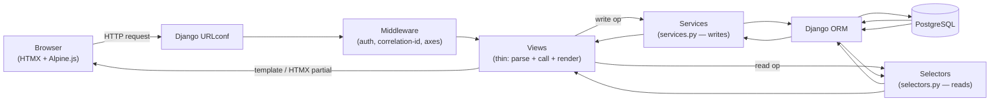
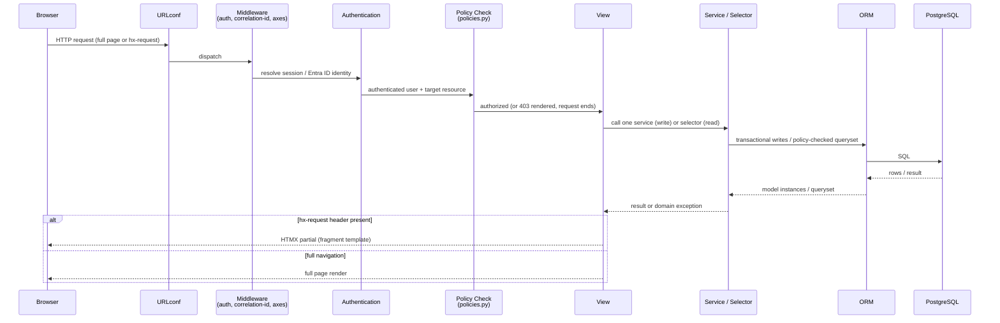

# Application Architecture

This document defines the internal application architecture of EMS: the layering contract, transaction boundary rules, and the HTMX/Alpine conventions that govern how a request is handled from browser to database and back. It assumes the modular-monolith app structure described in [django-app-map.md](./django-app-map.md) and the high-level flow introduced in [system-architecture.md](./system-architecture.md).

## 1. Layered Architecture



Views never call the ORM directly for anything beyond trivial, single-app, single-model lookups that carry no business rule (e.g. resolving the object named in a URL kwarg before handing it to a service). Every write path and every scoped/filtered read path goes through `services.py` / `selectors.py`.

## 2. Request Lifecycle



Notes:

- The **policy check** (step P) is not a separate middleware for object-level checks — coarse route access may be middleware/decorator-enforced, but object- and field-level authorization (e.g. "can this user view *this* employee's compensation") is evaluated inside the service/selector itself via `policies.py`, because it requires the specific object and the caller's scope, not just the route.
- Domain exceptions raised by a service (e.g. `OverlappingAssignmentError`, `PermissionDenied`) are translated by the view into a user-facing message (form error, HTMX error fragment, or Django message framework entry) — the view is the only layer allowed to know how to present an error, but it is never the layer that decides *whether* one occurs.

## 3. The Layering Contract

### 3.1 What a View may do

- Parse and validate request input at the HTTP level (query params, form data, path kwargs) using Django forms/`django-crispy-forms`.
- Resolve the acting user and any single object named directly in the URL (e.g. `get_object_or_404` scoped by a selector, not raw `Model.objects.get`).
- Call **exactly one** service function for a write, or **one** selector function (whose result may itself be paginated/annotated for display) for a read.
- Choose which template or HTMX partial to render based on the request (`HX-Request` header) and the service/selector result.
- Translate domain exceptions raised by the service into form errors, messages, or HTTP error responses.
- Fire lightweight, purely presentational logic (e.g. choosing which tab is active) — never anything that changes persisted state or authorization outcome.

### 3.2 What a View must never do

- Perform direct multi-model writes (`Model.objects.create` followed by another model's `.save()` in the view body) — that sequence belongs in a service, inside its transaction.
- Query another app's models directly (no `from apps.employees.models import Employee` inside `apps/leave/views.py`) — only that app's `selectors.py`/`services.py` may be imported.
- Contain business-rule branching (e.g. "if employee is on probation, disallow transfer") — that rule lives in the service, so it applies uniformly regardless of which view, management command, or future API endpoint calls it.
- Perform authorization checks inline with ad-hoc `if request.user.is_staff` logic — checks go through `policies.py` functions so the rule is defined once and reused by both views and services.

### 3.3 Transaction Boundary Rule

- Exactly **one `transaction.atomic()` block per service call**, opened at the top of the outermost service function invoked by the view.
- A service is permitted to call another app's service function as part of its own operation (e.g. `leave.services.approve_leave_request` calling `notifications.services.notify_user`). When it does, **only the outermost call opens the atomic block** — nested service calls execute inside the caller's existing transaction. Django's `transaction.atomic()` is reentrant via savepoints, so this is safe even if a nested service also declares its own `atomic()` block (it becomes a savepoint, not a new top-level transaction) — but the convention is to keep call graphs flat: a service should call at most one level of cross-app services, not chain through three or four, so the transaction shape stays easy to reason about.
- A service must never leave partially-committed state observable: if any step fails (validation, a nested service raising, a constraint violation), the whole atomic block rolls back, including any audit log or history rows written earlier in the same call.
- Audit logging (`audit` app `AuditLog` write) and django-simple-history snapshots happen **inside** the same transaction as the business write they describe — never after, never in a separate request/task. Notification dispatch is the one deliberate exception: services fire a Django **signal** synchronously inside the transaction, but the signal receiver enqueues a Celery task (once Celery is wired in) rather than performing the send inline, so a slow/failed downstream notification never blocks or rolls back the business transaction.

Canonical service shape (illustrative, not exhaustive — see [django-app-map.md](./django-app-map.md) for real per-app signatures):

```python
# apps/employees/services.py
def transfer_employee(*, employee, new_restaurant, effective_from, actor, reason) -> Assignment:
    if not policies.can_transfer_employee(actor, employee):
        raise PermissionDenied(...)
    _validate_transfer(employee, new_restaurant, effective_from)
    with transaction.atomic():
        assignment = _close_current_assignment_and_open_new(
            employee, new_restaurant, effective_from
        )
        audit.services.log_event(
            actor=actor, action="EMPLOYEE_TRANSFERRED", entity=employee, reason=reason
        )
        signals.employee_transferred.send(sender=Employee, employee=employee, assignment=assignment)
    return assignment
```

### 3.4 Selectors

- Selectors always apply scope filtering **first**, before any other filter, so it is structurally impossible for a caller to forget scoping — e.g. `get_employees_for_user(user, **filters)` starts from `Employee.objects.filter(<scope predicate for user>)` and only then applies `**filters`.
- `select_related`/`prefetch_related` are set once, centrally, inside the selector — not left to each view to remember — so N+1 query patterns cannot silently reappear at a new call site.
- Selectors never write; a selector calling `.save()` or `.delete()` is a contract violation.

## 4. HTMX Response Conventions

- Every view that supports partial updates checks the `HX-Request` header (via a small `core` template-tag/helper, not repeated per view): if present, render only the fragment template needed for that interaction (e.g. an updated table row, an inline approval status); otherwise render the full page template that extends the base layout.
- Fragment templates live alongside their full-page counterpart (e.g. `_leave_request_row.html` beside `leave_request_list.html`) and are the single source of truth for that piece of markup — the full page includes the same fragment on first render, so there is never a second, drifting copy of the markup.
- HTMX drives all dynamic behavior that needs server state: form submission without full reload, inline approve/reject actions, live search-as-you-type (backed by selectors with trigram/GIN-indexed search per [system-architecture.md](./system-architecture.md) §5.2), and polling for async task completion (e.g. an onboarding checklist generation).
- Out-of-band swaps (`hx-swap-oob`) are used sparingly and only for small, well-understood cases (e.g. updating a notification badge count alongside a primary swap) — not as a general multi-region update mechanism.

## 5. Alpine.js's Role

Alpine.js is used **exclusively for client-side UI state that has no server-side meaning**: toggling a dropdown, a modal's open/closed state, a multi-step form wizard's current step before submission, tab selection, or optimistic disabling of a submit button. Alpine state is never treated as a source of truth for data that must be persisted, authorized, or displayed consistently across sessions — that data always comes from a service/selector round-trip. If a piece of UI state needs to survive a page reload or be visible to another user, it does not belong in Alpine; it belongs in the database, fetched via a selector.

## 6. Background Processing (Celery)

The service-layer signal convention above is designed so that background processing can be introduced without changing any service's public contract: a service fires a Django signal inside its transaction; today (Phase 00) the receiver may be a synchronous no-op or direct send for the few cases that exist, and once Celery + Redis + Celery Beat are wired in (expected early Phase 01, driven by the first real async need — email/notification delivery), the same receiver calls `.delay()` instead. Each app that needs background work owns a `tasks.py` following this convention; no service function needs to change when a task moves from synchronous to asynchronous.

## 7. Related Documents

- [system-architecture.md](./system-architecture.md) — system context, NFRs, data privacy categories.
- [domain-architecture.md](./domain-architecture.md) — functional domain reference.
- [django-app-map.md](./django-app-map.md) — app responsibilities, dependency graph, and per-app service/selector examples.
- [../security/authorization.md](../security/authorization.md) — `UserScope`, Groups/Permissions, and `policies.py` detail.
