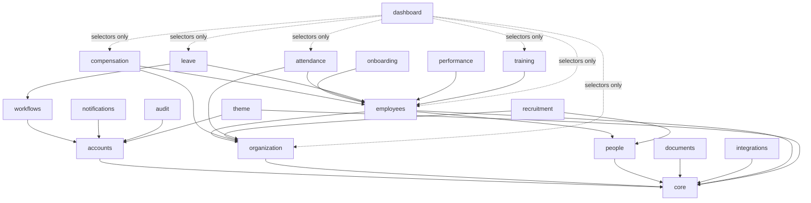

# Django App Map

This is the authoritative inventory of EMS's Django apps: one project, `apps/<domain>/` packages, communicating only through each app's public `services.py` (writes) and `selectors.py` (reads) — see [application-architecture.md](./application-architecture.md) for the layering contract these tables assume.

## 1. Dependency Graph

Solid edges are model/FK-level dependencies (app B's models or services reference app A). Dashed edges from `dashboard` are selector-only composition — `dashboard` never holds a foreign key into another app's models. `workforce planning` is not on this graph: it is a **future boundary only**, folding into `organization` + `dashboard` selectors today, with no models of its own.

## 2. App Reference

### core

| | |
|---|---|
| Responsibility | Shared mixins (timestamped, soft-delete), domain exception base classes, correlation-ID middleware, base template tags. No business data. |
| Core Models (belong here) | *(none — infrastructure only)* |
| Models that should NOT belong here | Any model carrying business data (e.g. `Employee`) — reason: `core` must stay dependency-free so every other app can safely import it without creating a cycle. |
| Dependencies | *(none)* |
| Public services exposed | `core` has no business services; it exposes mixins/base classes (`TimestampedModel`, `SoftDeleteModel`) and exception types (`DomainError`) for other apps to use, not service functions of its own. |
| Public selectors exposed | None — no queryable business data. |
| Major business rules | None (structural conventions only): every model in every other app inherits `TimestampedModel`; soft-delete is opt-in per model via `SoftDeleteModel`. |
| Independent-or-combine rationale | Must remain its own app: it is the only app every other app is allowed to depend on, and mixing any business model into it would immediately create a dependency cycle risk. |

### accounts

| | |
|---|---|
| Responsibility | Authentication (Entra ID via allauth + local fallback), custom `User`, and the `UserScope` authorization-scope layer. |
| Core Models (belong here) | `User`, `UserScope` |
| Models that should NOT belong here | `Person` — identity/PII belongs in `people`; not every `User` is a `Person` (vendor/auditor accounts) and not every `Person` needs a `User`. `Employee` — employment data is unrelated to login mechanics. |
| Dependencies | `core` |
| Public services exposed | `create_user_scope(*, user, scope_type, scope_id, actor) -> UserScope`; `revoke_user_scope(*, scope, actor) -> None`; `link_user_to_person(*, user, person, actor) -> None` |
| Public selectors exposed | `get_scopes_for_user(user) -> QuerySet[UserScope]`; `user_has_scope(user, scope_type, scope_id) -> bool` |
| Major business rules | A `User` may have zero, one, or many `UserScope` rows (e.g. an Area Manager scoped to one Area plus SELF); scope changes are always audit-logged and history-tracked via django-simple-history. |
| Independent-or-combine rationale | Independent: authentication/authorization is a cross-cutting concern every other app depends on indirectly (via `policies.py` checks); folding it into any domain app would make that app a hidden hard dependency for everyone. |

### organization

| | |
|---|---|
| Responsibility | Org-chart structure: regions, areas, restaurants, departments, and the job grade/position catalog. |
| Core Models (belong here) | `Region`, `Area`, `Restaurant`, `Department`, `JobGrade` |
| Models that should NOT belong here | `EmployeeAssignmentHistory` — belongs in `employees`; it is about a specific employee's timeline, not the org unit's own definition. `SalaryHistory` — compensation-specific, belongs in `compensation` for permission isolation. |
| Dependencies | `core` |
| Public services exposed | `open_restaurant(*, area, name, code, actor) -> Restaurant`; `move_restaurant_to_area(*, restaurant, new_area, effective_from, actor) -> None`; `create_job_grade(*, name, level, actor) -> JobGrade` |
| Public selectors exposed | `get_restaurants_for_scope(user) -> QuerySet[Restaurant]`; `get_areas_for_region(region) -> QuerySet[Area]`; `get_job_grade_catalog() -> QuerySet[JobGrade]` |
| Major business rules | A `Restaurant` belongs to exactly one `Area` at a time; a restaurant-to-area move is effective-dated, not a destructive update; org entities are soft-deleted only (historical assignments reference them permanently). |
| Independent-or-combine rationale | Independent: it is the foundational scope hierarchy that `UserScope`, `employees`, `attendance`, and `dashboard` all resolve against — merging it into `employees` would wrongly couple org structure's lifecycle to employee lifecycle. |

### people

| | |
|---|---|
| Responsibility | Person identity and PII: name, DOB, national ID, contact details, emergency contact, photo — independent of any employment relationship. |
| Core Models (belong here) | `Person`, `ContactInfo`, `EmergencyContact` |
| Models that should NOT belong here | `Employee` — employment status/number/org assignment is employment-specific; keeping it split is what enables one `Person` to have multiple `Employee` stints (rehires) and to exist as a `Candidate` before any `Employee` record. `Document` — generic document storage lives in `documents` via a generic relation, not duplicated per domain. |
| Dependencies | `core` |
| Public services exposed | `create_person(*, first_name, last_name, dob, national_id, actor) -> Person`; `update_contact_info(*, person, contact_data, actor) -> ContactInfo`; `update_emergency_contact(*, person, contact_data, actor) -> EmergencyContact` |
| Public selectors exposed | `find_person_by_national_id(national_id) -> Person \| None`; `get_person(public_id) -> Person` |
| Major business rules | National ID is unique per `Person`; `find_person_by_national_id` is the mechanism `recruitment`/`employees` use to detect a rehire/re-applicant instead of creating a duplicate identity. |
| Independent-or-combine rationale | Independent: this is precisely the split (decision #4) that makes rehire and pre-employment candidacy modeling possible — folding it into `employees` would break both. |

### employees

| | |
|---|---|
| Responsibility | The employee record itself (employee number, status, org assignment) plus effective-dated assignment history (restaurant/department/position/manager). |
| Core Models (belong here) | `Employee`, `EmployeeAssignmentHistory` |
| Models that should NOT belong here | `SalaryHistory` — belongs in `compensation`, not `employees`, for permission isolation (a Restaurant Manager sees the roster but not salaries). `AttendanceRecord` — high-volume operational data lives in `attendance` to keep this app focused on identity/assignment, not day-to-day punches. |
| Dependencies | `core`, `people`, `organization` |
| Public services exposed | `hire_employee(*, person, restaurant, position, effective_from, actor) -> Employee`; `transfer_employee(*, employee, new_restaurant, effective_from, actor, reason) -> Assignment`; `promote_employee(*, employee, new_position, effective_from, actor) -> Assignment`; `terminate_employee(*, employee, effective_from, reason, actor) -> None` |
| Public selectors exposed | `get_employees_for_user(user, **filters) -> QuerySet[Employee]`; `get_current_assignment(employee) -> EmployeeAssignmentHistory`; `get_assignment_history(employee) -> QuerySet[EmployeeAssignmentHistory]` |
| Major business rules | No gap or overlap in `EmployeeAssignmentHistory` per employee — enforced with a Postgres `ExclusionConstraint` on `daterange(effective_from, effective_to)`; "current" = the row whose range contains today; future-dated rows are permitted. |
| Independent-or-combine rationale | Independent (central) app: it is the hub every operational domain (Leave, Attendance, Performance, Training) depends on; it stays deliberately thin on PII (in `people`) and pay (in `compensation`) to preserve those permission boundaries. |

### compensation

| | |
|---|---|
| Responsibility | Salary and benefits history, held behind a permission boundary isolated from general employee visibility. |
| Core Models (belong here) | `SalaryHistory`, `BenefitEnrollment` |
| Models that should NOT belong here | `Employee` — pulling it in would collapse the exact permission boundary this app exists to create. `PerformanceReview` — rating data belongs in `performance`; any pay-for-performance link is a human decision, not a modeled FK. |
| Dependencies | `employees`, `organization` |
| Public services exposed | `record_salary_change(*, employee, new_amount, grade, effective_from, actor, reason) -> SalaryHistory`; `enroll_benefit(*, employee, benefit_type, effective_from, actor) -> BenefitEnrollment` |
| Public selectors exposed | `get_current_salary(employee) -> SalaryHistory` (raises/returns None if caller lacks `view_compensation`); `get_salary_history(employee) -> QuerySet[SalaryHistory]` |
| Major business rules | Effective-dated with the same non-overlap `ExclusionConstraint` pattern as `EmployeeAssignmentHistory`; `view_compensation` is a distinct Django permission from `view_employee`, checked in every selector before any row is returned. |
| Independent-or-combine rationale | Deliberately kept out of `employees` — this is the app map's canonical example of app-boundary-as-permission-boundary (decision #6): merging it would make it structurally impossible to show a Restaurant Manager their roster without also exposing pay. |

### recruitment

| | |
|---|---|
| Responsibility | Hiring funnel: job requisitions, candidates, applications, interviews, ending in a hire handoff. |
| Core Models (belong here) | `Candidate`, `JobRequisition`, `Application` |
| Models that should NOT belong here | `Employee` — created only once a hire is finalized, via a service call into `employees`, never modeled directly here. `OnboardingTask` — onboarding begins after hire and is owned by `onboarding`. |
| Dependencies | `people`, `organization` |
| Public services exposed | `create_requisition(*, restaurant, position, headcount, actor) -> JobRequisition`; `submit_application(*, candidate, requisition) -> Application`; `hire_candidate(*, candidate, restaurant, position, effective_from, actor) -> Employee` |
| Public selectors exposed | `get_open_requisitions_for_scope(user) -> QuerySet[JobRequisition]`; `get_applications_for_requisition(requisition) -> QuerySet[Application]` |
| Major business rules | A requisition must be approved (via `workflows`) before it can accept applications; `hire_candidate` first checks `people.selectors.find_person_by_national_id` to avoid creating a duplicate `Person` for a returning candidate. |
| Independent-or-combine rationale | Independent: its lifecycle (open requisition → interview → hire/reject) is materially different from post-hire domains, and its models (Candidate, Application) have no meaning once a hire completes. |

### onboarding

| | |
|---|---|
| Responsibility | Per-hire checklist of tasks to complete before/at start date, instantiated from templates. |
| Core Models (belong here) | `OnboardingChecklist`, `OnboardingTask` |
| Models that should NOT belong here | `Document` — uploaded documents are referenced generically from `documents`, not stored here. |
| Dependencies | `employees` |
| Public services exposed | `generate_checklist_for_hire(*, employee, template, actor) -> OnboardingChecklist`; `complete_task(*, task, actor) -> OnboardingTask` |
| Public selectors exposed | `get_pending_tasks_for_employee(employee) -> QuerySet[OnboardingTask]` |
| Major business rules | A checklist is generated automatically on the `hire_employee` signal — no manual step required for the default template. |
| Independent-or-combine rationale | **Merge candidate**: called out explicitly in the app map as small enough to fold into `employees` if it stays thin (two models, no independent permission boundary, no domain it needs isolation from). Kept separate for now for conceptual clarity during early build-out. |

### attendance

| | |
|---|---|
| Responsibility | Shift rostering and attendance record capture per employee per restaurant. |
| Core Models (belong here) | `Shift`, `AttendanceRecord` |
| Models that should NOT belong here | `LeaveRequest` — absence tracking lives in `leave`; attendance reconciles against it via selector, not FK ownership. `Restaurant` — org structure belongs in `organization`. |
| Dependencies | `employees`, `organization` |
| Public services exposed | `record_attendance(*, employee, shift, clock_in, clock_out, actor) -> AttendanceRecord`; `create_shift(*, restaurant, date, start_time, end_time, actor) -> Shift` |
| Public selectors exposed | `get_attendance_for_employee(employee, date_range) -> QuerySet[AttendanceRecord]`; `get_roster_for_restaurant(restaurant, date_range) -> QuerySet[Shift]` |
| Major business rules | An `AttendanceRecord` must reference the restaurant that matches the employee's *current* assignment at that date (cross-checked against `employees.selectors.get_current_assignment`), preventing attendance logged against a restaurant already transferred out of. |
| Independent-or-combine rationale | Independent: this is the highest-projected-volume domain (millions of rows over years, per [system-architecture.md](./system-architecture.md) §5.3) and the primary future integration point (biometric devices) — isolating it keeps that growth and integration surface from touching `employees`. |

### leave

| | |
|---|---|
| Responsibility | Leave types, balances, requests, and approval routing. |
| Core Models (belong here) | `LeaveType`, `LeaveBalance`, `LeaveRequest` |
| Models that should NOT belong here | `WorkflowRequest` — the generic approval shape lives in `workflows` and is referenced, not duplicated, per request. `AttendanceRecord` — absence-day reconciliation reads attendance via selector rather than owning it. |
| Dependencies | `employees`, `workflows` |
| Public services exposed | `submit_leave_request(*, employee, leave_type, start_date, end_date, actor) -> LeaveRequest`; `approve_leave_request(*, request, approver, actor) -> LeaveRequest`; `cancel_leave_request(*, request, actor) -> None` |
| Public selectors exposed | `get_leave_balance(employee, leave_type) -> LeaveBalance`; `get_pending_requests_for_approver(user) -> QuerySet[LeaveRequest]` |
| Major business rules | A request cannot be approved by anyone outside the requester's scope chain (`policies.can_approve_leave`); balance can never go negative — enforced in the approval service itself, not only client-side; overlapping requests for the same employee are rejected at submission. |
| Independent-or-combine rationale | Independent: it is the first (and reference) consumer of the shared `workflows` shape, and its balance/accrual rules are domain-specific enough to warrant its own app rather than folding into `employees` or `attendance`. |

### performance

| | |
|---|---|
| Responsibility | Performance reviews and goal/KPI tracking. |
| Core Models (belong here) | `PerformanceReview`, `Goal` |
| Models that should NOT belong here | `TrainingRecord` — training completions live in `training`; any relationship is informal/manual, not a modeled FK. `SalaryHistory` — compensation decisions stay a human-linked process, not a direct dependency, to avoid coupling review cycles to pay cycles. |
| Dependencies | `employees` |
| Public services exposed | `create_review(*, employee, reviewer, cycle, actor) -> PerformanceReview`; `submit_review_ratings(*, review, ratings, actor) -> PerformanceReview`; `set_goal(*, employee, description, target_date, actor) -> Goal` |
| Public selectors exposed | `get_reviews_for_employee(employee) -> QuerySet[PerformanceReview]`; `get_active_goals(employee) -> QuerySet[Goal]` |
| Major business rules | A review is visible only to the employee, their manager chain (scoped), and HR — never peers; enforced in the selector via `policies.can_view_performance`. |
| Independent-or-combine rationale | Independent: reviews carry their own confidentiality/visibility rule distinct from general employee visibility, similar in spirit to (though less strict than) the compensation boundary. |

### training

| | |
|---|---|
| Responsibility | Course catalog, completion records, and certification expiry tracking. |
| Core Models (belong here) | `TrainingCourse`, `TrainingRecord` |
| Models that should NOT belong here | `Document` (certificate files) — stored in `documents`, referenced generically. `Notification` — expiry alerts are dispatched via `notifications`, not modeled here. |
| Dependencies | `employees` |
| Public services exposed | `publish_course(*, title, description, mandatory, actor) -> TrainingCourse`; `record_completion(*, employee, course, completed_on, expires_on, actor) -> TrainingRecord` |
| Public selectors exposed | `get_training_records_for_employee(employee) -> QuerySet[TrainingRecord]`; `get_expiring_certifications(within_days) -> QuerySet[TrainingRecord]` |
| Major business rules | `get_expiring_certifications` is the source selector for a scheduled Celery task that fires `notifications` events; mandatory-course completion may gate confirmation, but that gate is enforced by the `employees`/`onboarding` service that checks it, not by `training` reaching into those apps. |
| Independent-or-combine rationale | Independent: it has its own catalog/versioning concerns (course content, expiry rules) unrelated to `performance`, and is a clear future integration point (external LMS) that benefits from isolation. |

### documents

| | |
|---|---|
| Responsibility | Document storage metadata and verification status, referenced by other domains via a generic relation. |
| Core Models (belong here) | `Document` |
| Models that should NOT belong here | Domain-specific verification workflow state (e.g. a candidate-document-specific approval flow) — kept generic; domain-specific rules live in the referencing app's service, not in `documents` itself. |
| Dependencies | `core` |
| Public services exposed | `upload_document(*, owner_object, file, document_type, actor) -> Document`; `verify_document(*, document, actor) -> Document` |
| Public selectors exposed | `get_documents_for(owner_object) -> QuerySet[Document]`; `get_unverified_documents_for_scope(user) -> QuerySet[Document]` |
| Major business rules | `Document` uses a generic relation (content type + object id) to attach to any domain entity, so `documents` has zero model dependency on `people`, `employees`, `recruitment`, or `training` — those apps depend on `documents`, never the reverse. |
| Independent-or-combine rationale | Independent: the generic-relation design is precisely what lets every PII/HR domain reuse one storage-and-verification mechanism instead of five bespoke ones. |

### workflows

| | |
|---|---|
| Responsibility | One shared, lightweight approval-request shape (status, requester, current approver, history) reused by Leave, Employment (promotion/transfer), and Exit-type approvals. |
| Core Models (belong here) | `WorkflowRequest` |
| Models that should NOT belong here | `LeaveRequest`, or any other domain-specific request model — those stay in their owning app; `workflows` supplies the shared shape/history via composition, never by owning domain-specific fields. |
| Dependencies | `accounts` |
| Public services exposed | `create_workflow_request(*, requester, current_approver, request_type, reference_object, actor) -> WorkflowRequest`; `advance_workflow(*, workflow_request, decision, actor, comment) -> WorkflowRequest` |
| Public selectors exposed | `get_pending_for_approver(user) -> QuerySet[WorkflowRequest]`; `get_history(workflow_request) -> QuerySet` |
| Major business rules | `workflows` owns only shape and history — *who can approve what, in what order* is decided by the owning domain's service (e.g. `leave.services.approve_leave_request` calls `advance_workflow` after its own policy check, not before). No generic workflow engine is introduced unless 3+ workflows need genuinely divergent multi-step/parallel-approval logic — currently none do. |
| Independent-or-combine rationale | Independent by design: it exists specifically so `leave`, `employees` (promotion/transfer), and future termination/headcount flows do not each reimplement approval-chain plumbing — while deliberately staying a thin shape rather than a full workflow engine. |

### notifications

| | |
|---|---|
| Responsibility | In-app/email/Teams notification records, delivery, and per-user preferences. |
| Core Models (belong here) | `Notification`, `NotificationPreference` |
| Models that should NOT belong here | Domain event definitions — each domain defines and fires its own Django signal; `notifications` only listens and dispatches, it never owns what counts as a notifiable event. |
| Dependencies | `accounts` |
| Public services exposed | `notify_user(*, user, message, category, related_object) -> Notification`; `mark_read(*, notification, actor) -> None`; `update_preferences(*, user, preferences, actor) -> NotificationPreference` |
| Public selectors exposed | `get_unread_notifications(user) -> QuerySet[Notification]`; `get_preferences(user) -> NotificationPreference` |
| Major business rules | Dispatch happens via a Celery task once background processing is wired in (per [application-architecture.md](./application-architecture.md) §6) — never synchronously inside the originating service's own transaction, so a slow/failed send cannot roll back a business write. |
| Independent-or-combine rationale | Independent: it is a cross-cutting sink for every domain's signals; folding it into any one domain would make that domain a hidden dependency for all the others that need to notify. |

### theme

| | |
|---|---|
| Responsibility | Theme configuration (structured fields + JSON `extra` bag) rendered to CSS custom properties served at `/theme.css`. |
| Core Models (belong here) | `ThemeConfiguration` |
| Models that should NOT belong here | Any model representing Tailwind class names or template markup — theme only ever stores *data* (CSS variable values); class names are fixed and static in code, never generated from the database. |
| Dependencies | `core`, `accounts` |
| Public services exposed | `update_theme(*, configuration_data, actor) -> ThemeConfiguration` (bumps the CSS version/cache-bust key as part of the same transaction) |
| Public selectors exposed | `get_active_theme() -> ThemeConfiguration`; `render_theme_css() -> str` (used by the `/theme.css` view) |
| Major business rules | Editing theme data never creates new Tailwind utility classes — Tailwind's utility set is fixed at build time (`bg-[var(--color-primary)]`, `rounded-[var(--radius-card)]`, etc.); `/theme.css` is versioned/cache-busted on every save so browsers pick up changes without a deploy. |
| Independent-or-combine rationale | Independent: it is a Head-Office-facing configuration surface with its own save/versioning lifecycle, unrelated to any HR domain — bundling it into `core` or `accounts` would mix infrastructure with editable business configuration. |

### dashboard

| | |
|---|---|
| Responsibility | Cross-domain read aggregation for landing pages and widgets — composes other apps' selectors, holds almost no data of its own. |
| Core Models (belong here) | `DashboardWidgetPreference` |
| Models that should NOT belong here | Any duplicated business data — `dashboard` must never cache/copy another app's rows into its own models; it always calls that app's selector (live, or behind a short-TTL cache) to avoid drift from the source of truth. |
| Dependencies | Selectors of `employees`, `organization`, `leave`, `attendance`, `compensation` (permission-gated), `training` |
| Public services exposed | `save_widget_preferences(*, user, layout, actor) -> DashboardWidgetPreference` |
| Public selectors exposed | `get_headcount_summary_for_scope(user) -> dict`; `get_pending_approvals_summary(user) -> dict`; `get_widget_preferences(user) -> DashboardWidgetPreference` |
| Major business rules | Because every underlying selector already applies scope/permission filtering, a dashboard widget is automatically scope- and permission-correct by construction — `dashboard` adds no authorization logic of its own, only composition and caching. |
| Independent-or-combine rationale | Independent: it is intentionally the *only* app allowed to depend on many other apps' selectors at once (a hub-of-reads), which is precisely why it must own no writable business data — that asymmetry is the app's whole reason to exist separately from any one domain. |

### audit

| | |
|---|---|
| Responsibility | Business-event-level audit log ("what happened": actor, timestamp, action, entity, entity id, reason, IP, correlation ID) plus a viewer. |
| Core Models (belong here) | `AuditLog` |
| Models that should NOT belong here | django-simple-history tables — those are field-level history owned by each domain model directly (via `HistoricalRecords()`), not by the `audit` app; keeping them separate avoids modeling the same concern two different ways in one place. |
| Dependencies | `accounts` |
| Public services exposed | `log_event(*, actor, action, entity, entity_id, reason=None, correlation_id=None) -> AuditLog` |
| Public selectors exposed | `get_audit_trail_for(entity) -> QuerySet[AuditLog]`; `get_events_by_actor(user, date_range) -> QuerySet[AuditLog]` |
| Major business rules | `log_event` is always called from inside the originating service's own `transaction.atomic()` block, so a rollback rolls back the audit entry too — the log can never show an event that did not actually commit. |
| Independent-or-combine rationale | Independent: it is the hybrid audit approach's second half (decision #7) — a single cross-domain event log that every service writes to, which would be meaningless split apart per domain. |

### integrations

| | |
|---|---|
| Responsibility | External system mapping, sync jobs, and logs for future integrations (Dynamics 365 F&O, Payroll, biometric devices, Power BI). Not active in Phase 00/01. |
| Core Models (belong here) | `ExternalSystem`, `ExternalIdentifier`, `IntegrationLog`, `SyncJob` |
| Models that should NOT belong here | An external-ID field placed directly on a domain model (e.g. `Employee.dynamics_id`) — always stored in `ExternalIdentifier` instead, so domain models never carry integration-specific columns and integrations can be added/removed without a domain migration. |
| Dependencies | `core` |
| Public services exposed | `register_external_system(*, name, system_type, actor) -> ExternalSystem`; `map_external_identifier(*, entity, external_system, external_id, actor) -> ExternalIdentifier`; `run_sync_job(*, sync_job, actor) -> IntegrationLog` |
| Public selectors exposed | `get_external_identifier(entity, external_system) -> ExternalIdentifier \| None`; `get_recent_sync_logs(external_system) -> QuerySet[IntegrationLog]` |
| Major business rules | External identifiers are never primary keys — always a mapping row keyed by (content type, object id, external system); no sync job executes until the corresponding integration is explicitly enabled in Phase 2+. |
| Independent-or-combine rationale | Independent: isolating all external-system coupling in one app means Phase 2+ integration work never touches domain-app internals — every domain app stays completely unaware of which (if any) external systems it is mapped to. |

### workforce planning (future boundary — no app yet)

| | |
|---|---|
| Responsibility | Headcount planning/forecasting against org structure. **Not built** — explicitly out of scope for the current phase. |
| Core Models (belong here) | None yet. |
| Models that should NOT belong here | N/A — no app exists to misplace models into. |
| Dependencies (if built) | Would depend on `organization`, `employees`, `dashboard`. |
| Public services exposed | None. |
| Public selectors exposed | None. |
| Major business rules | None defined. |
| Independent-or-combine rationale | Currently folded into `organization` (structure) + `dashboard` (read aggregation) selectors. Becomes its own app only if/when headcount planning grows write-side business logic that doesn't belong in either of those. |

## 3. Related Documents

- [system-architecture.md](./system-architecture.md)
- [application-architecture.md](./application-architecture.md) — the layering contract (`services.py`/`selectors.py` as the only public surface) that this map's "Public services/selectors exposed" columns assume.
- [domain-architecture.md](./domain-architecture.md) — the functional domain view these apps implement.
