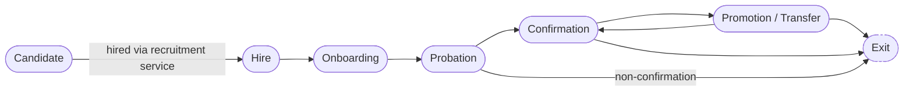

# Domain Architecture

This document is a **functional architecture reference**, not a full specification. Each domain below maps to one or more apps in [django-app-map.md](./django-app-map.md); consult that document for exact models, service/selector signatures, and dependency edges.

## 1. Employee Lifecycle

- **Candidate → Hire**: `recruitment` converts a `Candidate` into a `Person` (if one does not already exist) and creates the first `Employee` stint — a service-level operation, not a direct model create, because it must check for an existing `Person` (rehire case) before creating a duplicate identity.
- **Promotion/Transfer** loops back to **Confirmation** because a confirmed employee can be promoted or transferred repeatedly across their tenure; each such change is a new effective-dated `EmployeeAssignmentHistory` row, never an edit of a past row.
- **Exit** can be reached from Probation (non-confirmation), Confirmation, or after any Promotion/Transfer — it closes the current `Employee` stint (`effective_to` set, status changed) without deleting history, and without altering the underlying `Person`, so a future rehire re-uses the same `Person` record.

## 2. Domain Reference

### Organization

| Field | Detail |
|---|---|
| Purpose | Model the org chart that every other domain hangs assignments off: regions, areas, restaurants, departments, and the job grade/position catalog. |
| Actors | HR, Head Office, Regional/Area Management |
| Core Entities | Region, Area, Restaurant, Department, JobGrade |
| Key Processes | Create/restructure regions and areas; open/close restaurants; maintain the job grade and position catalog. |
| Business Rules | A Restaurant belongs to exactly one Area at a time (effective-dated if restaurant ever moves areas); org entities are soft-deleted, never hard-deleted, since historical assignments reference them. |
| Inputs | Head Office org-design decisions; restaurant opening/closing schedule. |
| Outputs | The scope hierarchy (`UserScope` REGION/AREA/RESTAURANT/DEPARTMENT values resolve against this domain) and the position catalog used by Employment. |
| Dependencies | `core` only — this is a foundational domain everything else depends on. |
| Future Integrations | Dynamics 365 F&O org-unit sync (Phase 2+, via `integrations`). |

### Employee

| Field | Detail |
|---|---|
| Purpose | Represent a person's identity (independent of employment) and their current/past employment record(s), supporting rehires and pre-employment candidacy. |
| Actors | HR, Employees (self-service), Managers (scoped read) |
| Core Entities | Person, ContactInfo, EmergencyContact (identity, in `people`); Employee (employment record, in `employees`) |
| Key Processes | Create/update person identity; issue an employee number on hire; maintain status (active/on-leave/terminated); support multiple Employee stints per Person across rehires. |
| Business Rules | `Person` and `Employee` are always separate rows — a `Candidate` becomes a `Person` before any `Employee` exists; a rehire creates a new `Employee` linked to the existing `Person`, never a new `Person`. |
| Inputs | Recruitment hire decision, HR-entered PII updates. |
| Outputs | The `Employee` reference every other domain (Employment, Leave, Attendance, Compensation, Performance, Training) attaches to. |
| Dependencies | `core`, `people` |
| Future Integrations | Dynamics 365 F&O worker sync (Phase 2+). |

### Employment

| Field | Detail |
|---|---|
| Purpose | Track where an employee sits in the org over time — restaurant, department, position, manager — as an effective-dated, non-overlapping history. |
| Actors | HR, Restaurant/Area/Regional Management |
| Core Entities | EmployeeAssignmentHistory (in `employees`); JobGrade/Position (catalog, in `organization`) |
| Key Processes | Transfer employee to a new restaurant/department; change manager; promote to a new job grade/position — each via a service function (`transfer_employee`, `promote_employee`) that closes the current row and opens a new one atomically. |
| Business Rules | No gap or overlap in assignment history per employee — enforced with a Postgres `ExclusionConstraint` on `daterange(effective_from, effective_to)`, not just application validation; the "current" assignment is the row whose range contains today; future-dated assignments are allowed and expected (e.g. a transfer scheduled for next month). |
| Inputs | HR/manager-initiated transfer, promotion, or manager-change requests (often via a `workflows` approval first). |
| Outputs | The employee's current and historical org placement, consumed by Attendance (which restaurant a shift belongs to), Compensation (grade-linked pay bands), and dashboards. |
| Dependencies | `core`, `people`, `organization`, `employees` |
| Future Integrations | Dynamics 365 F&O cost-center/org sync (Phase 2+). |

### Recruitment

| Field | Detail |
|---|---|
| Purpose | Manage the hiring funnel from open requisition through candidate, application, and interview, ending in a hire that hands off to Employee/Onboarding. |
| Actors | HR, Restaurant/Area Management (requisition requesters and interviewers) |
| Core Entities | Candidate, JobRequisition, Application (in `recruitment`) |
| Key Processes | Raise and approve a requisition; receive applications; schedule/record interviews; convert a successful `Candidate` to `Person` + `Employee` via a single service call. |
| Business Rules | A requisition must be approved (via `workflows`) before it can accept applications; converting a candidate never creates a duplicate `Person` if one already exists for that individual (e.g. a former employee reapplying). |
| Inputs | Headcount requests, applicant submissions. |
| Outputs | New `Employee` records feeding Onboarding. |
| Dependencies | `people`, `organization` |
| Future Integrations | Job-board/LinkedIn posting sync, Power Apps candidate portal (Phase 2+). |

### Onboarding

| Field | Detail |
|---|---|
| Purpose | Track the checklist of tasks a new hire and HR must complete before/at start date. |
| Actors | HR, Restaurant Management, new Employee |
| Core Entities | OnboardingChecklist, OnboardingTask (in `onboarding`) |
| Key Processes | Instantiate a checklist from a template on hire; assign and track task completion (documents collected, system access requested, orientation scheduled). |
| Business Rules | A checklist is generated automatically when an `Employee` record is created via the hire service; tasks can be assigned to HR, the manager, or the employee. |
| Inputs | New `Employee` creation event (signal from `employees`). |
| Outputs | Completion status feeding the Probation/Confirmation step of the lifecycle. |
| Dependencies | `employees` |
| Future Integrations | None planned; this app is small and is a **merge candidate into `employees`** if it stays thin — see [django-app-map.md](./django-app-map.md). |

### Leave

| Field | Detail |
|---|---|
| Purpose | Manage leave types, accrual/balances, requests, and their approval. |
| Actors | Employees, Restaurant/Area/Regional Management (approvers), HR |
| Core Entities | LeaveType, LeaveBalance, LeaveRequest (in `leave`); WorkflowRequest (shared shape, in `workflows`) |
| Key Processes | Request leave; route through the approval chain; deduct/restore balance on approval/cancellation. |
| Business Rules | A `LeaveRequest` cannot be approved by someone outside the requester's scope chain; balance cannot go negative (enforced in the approval service, not just UI); overlapping leave requests for the same employee are rejected. |
| Inputs | Employee-submitted requests, manager decisions. |
| Outputs | Approved/rejected leave records feeding Attendance (absence days) and dashboards. |
| Dependencies | `employees`, `workflows` |
| Future Integrations | Payroll leave-encashment export (Phase 2+). |

### Attendance

| Field | Detail |
|---|---|
| Purpose | Record shifts and attendance punches per employee per restaurant. |
| Actors | Restaurant Management, Employees (self-view), HR |
| Core Entities | Shift, AttendanceRecord (in `attendance`) |
| Key Processes | Roster shifts; record clock-in/out (manual entry today; biometric feed in Phase 2+); reconcile against approved leave. |
| Business Rules | An `AttendanceRecord` must reference the employee's *current* assignment's restaurant at that date (validated against Employment history), preventing attendance logged against a restaurant the employee had already transferred out of. |
| Inputs | Manual entry (Phase 00/01), biometric device feed (Phase 2+). |
| Outputs | Attendance data feeding Payroll export and dashboards. This is the highest-volume table in the system, driving the `BigAutoField` PK decision (see [system-architecture.md](./system-architecture.md) §5.3). |
| Dependencies | `employees`, `organization` |
| Future Integrations | Biometric/attendance device integration, Payroll export (Phase 2+). |

### Compensation

| Field | Detail |
|---|---|
| Purpose | Hold salary and benefits history, isolated behind its own permission from general employee data. |
| Actors | Finance/Payroll, HR (limited), Head Office |
| Core Entities | SalaryHistory, BenefitEnrollment (in `compensation`) |
| Key Processes | Record salary changes (linked to promotions/transfers); enroll/update benefits. |
| Business Rules | Effective-dated with the same non-overlap `ExclusionConstraint` pattern as Employment; `view_compensation` is a distinct permission from `view_employee` — a Restaurant Manager who can see their team cannot see pay unless separately granted. |
| Inputs | HR/Finance-initiated salary revisions, promotion-linked pay changes. |
| Outputs | Compensation data feeding Payroll export (Phase 2+) and restricted dashboards. |
| Dependencies | `employees`, `organization` |
| Future Integrations | Payroll system export/sync (Phase 2+). |

### Performance

| Field | Detail |
|---|---|
| Purpose | Manage performance reviews and goal/KPI tracking. |
| Actors | Employees, Managers, HR |
| Core Entities | PerformanceReview, Goal (in `performance`) |
| Key Processes | Cycle-based or ad-hoc review creation; goal setting and tracking; rating rollups. |
| Business Rules | A review is visible to the employee, their manager chain, and HR only — never to peers; review cycles are scoped by the reviewer's `UserScope`. |
| Inputs | Manager-entered reviews, employee self-assessments. |
| Outputs | Ratings/goal data feeding Analytics dashboards and (potentially) Compensation decisions (manual link, not automated in Phase 00/01). |
| Dependencies | `employees` |
| Future Integrations | None planned in near term. |

### Training

| Field | Detail |
|---|---|
| Purpose | Track course catalog, completions, and certification expiry. |
| Actors | Training team, Employees, Restaurant Management |
| Core Entities | TrainingCourse, TrainingRecord (in `training`) |
| Key Processes | Publish courses; record completions/certifications; flag upcoming expiries. |
| Business Rules | Certification expiry drives notification scheduling (via `notifications`); mandatory-course completion may gate confirmation (business-rule link, enforced at the Onboarding/Employment level, not inside `training` itself). |
| Inputs | Training team course definitions, completion records (manual or LMS import, future). |
| Outputs | Completion/expiry status feeding Notifications and dashboards. |
| Dependencies | `employees` |
| Future Integrations | External LMS integration (Phase 2+, via `integrations`). |

### Workforce Planning

| Field | Detail |
|---|---|
| Purpose | Headcount planning and forecasting against the org structure. |
| Actors | Head Office, Regional/Area Management |
| Core Entities | None yet — **future boundary only**. Folds into `organization` (structure) and `dashboard` (read aggregation) selectors for now. |
| Key Processes | Not built. Anticipated: headcount budget vs. actual comparison, restaurant staffing-level forecasting. |
| Business Rules | None yet defined. |
| Inputs | N/A |
| Outputs | N/A |
| Dependencies | Would depend on `organization`, `employees`, `dashboard` if/when built. |
| Future Integrations | Possible Power BI-driven forecasting (Phase 2+). |

### Documents

| Field | Detail |
|---|---|
| Purpose | Store document metadata and verification status for artifacts referenced across domains (ID scans, contracts, certificates). |
| Actors | HR, Employees (upload/view own), Training (certificates), Recruitment (candidate documents) |
| Core Entities | Document (in `documents`) |
| Key Processes | Upload; verify (HR marks a document as verified, with an audit trail); associate with any domain entity via a generic relation. |
| Business Rules | A `Document` is referenced by other domains via a generic relation rather than a hard FK from every domain, so `documents` never needs to depend on `employees`, `recruitment`, or `training` — those apps depend on `documents`, not the reverse. |
| Inputs | User uploads (via FilePond). |
| Outputs | Verified/unverified document status consumed by Onboarding, Recruitment, Training. |
| Dependencies | `core` only |
| Future Integrations | Document storage backend via django-storages (e.g. cloud blob storage) — infrastructure choice, not a business integration. |

### Notifications

| Field | Detail |
|---|---|
| Purpose | Deliver in-app/email/Teams notifications and manage per-user preferences. |
| Actors | All users (recipients); every domain (senders, indirectly via signals) |
| Core Entities | Notification, NotificationPreference (in `notifications`) |
| Key Processes | Receive a domain signal (leave approved, certification expiring, document verified); render and dispatch according to the recipient's preference; record delivery status. |
| Business Rules | Dispatch happens via Celery task once background processing is wired in (see [application-architecture.md](./application-architecture.md) §6) — never synchronously inside the originating service's transaction. |
| Inputs | Signals fired by other apps' services. |
| Outputs | Delivered notifications; read/unread state for in-app display. |
| Dependencies | `accounts` |
| Future Integrations | Microsoft Teams delivery channel (Phase 2+, alongside email). |

### Workflow

| Field | Detail |
|---|---|
| Purpose | Provide one shared, lightweight approval-request shape reused by Leave, Employment (promotion/transfer), and Exit (termination/headcount) rather than a bespoke approval model per domain. |
| Actors | Requesters (any domain), Approvers (scoped by role/`UserScope`) |
| Core Entities | WorkflowRequest (status, requester, current approver, history) (in `workflows`) |
| Key Processes | Create a request; advance through approver chain; record decision history; expose status back to the owning domain's service. |
| Business Rules | Domain services (in `leave`, `employees`, etc.) own the *transition logic* (who can approve what, in what order) — `workflows` owns only the *shape and history*. No generic workflow engine is introduced unless three or more workflows need genuinely divergent multi-step/parallel-approval logic (none currently do). |
| Inputs | Domain-initiated approval requests. |
| Outputs | Approval/rejection decisions consumed by the owning domain's service to complete its own transactional write. |
| Dependencies | `accounts` |
| Future Integrations | None planned; a generic engine remains explicitly out of scope until the three-workflow threshold is met. |

### Analytics

| Field | Detail |
|---|---|
| Purpose | Cross-domain read aggregation for landing-page widgets and management dashboards, without owning business data itself. |
| Actors | Management, Head Office, Regional/Area Management |
| Core Entities | DashboardWidgetPreference (its only own model, in `dashboard`) — all substantive data comes from other domains' selectors. |
| Key Processes | Compose selectors from Employment, Leave, Attendance, Compensation (where permitted), Training into widget-ready aggregates; cache short-TTL results per [system-architecture.md](./system-architecture.md) §5.2. |
| Business Rules | `dashboard` never queries other apps' models directly — it composes their public selectors, so a dashboard widget is automatically scope- and permission-correct because the underlying selector already enforces it. |
| Inputs | Selector output from every other domain. |
| Outputs | Widget data for the landing pages; potential future extract for Power BI. |
| Dependencies | Selectors of `employees`, `organization`, `leave`, `attendance`, `compensation` (permission-gated), `training` |
| Future Integrations | Power BI extract/embedding (Phase 2+). |

### Audit

| Field | Detail |
|---|---|
| Purpose | Capture business-event-level "what happened" (as distinct from django-simple-history's field-level "what changed") for compliance and investigation. |
| Actors | HR, Head Office (viewers); every domain (writers, indirectly via service calls) |
| Core Entities | AuditLog (actor, timestamp, action, entity, entity id, reason, IP, correlation ID) (in `audit`) |
| Key Processes | Every service call that represents a business event (leave approved, document verified, login failure, theme changed) writes one `AuditLog` row inside its own transaction. |
| Business Rules | Audit writes are never optional/best-effort for sensitive operations — they occur inside the same `transaction.atomic()` as the business write, so a rollback rolls back the audit entry too, keeping the log consistent with actual committed state. |
| Inputs | Service-layer calls across all domains. |
| Outputs | Queryable audit trail for HR/compliance review. |
| Dependencies | `accounts` |
| Future Integrations | Possible export to a SIEM/compliance tool (Phase 2+, not currently planned). |

### Integrations

| Field | Detail |
|---|---|
| Purpose | Own the mapping, sync jobs, and logs for every external system connection, keeping external identifiers out of core domain tables. |
| Actors | Head Office IT, system administrators |
| Core Entities | ExternalSystem, ExternalIdentifier, IntegrationLog, SyncJob (in `integrations`) |
| Key Processes | Not active in Phase 00/01. Anticipated: map EMS entities to Dynamics 365 F&O / Payroll / biometric device identifiers; run and log scheduled sync jobs. |
| Business Rules | External IDs are **never** primary keys on domain models — they are always stored in `ExternalIdentifier` as a mapping row, so EMS's own identifiers remain stable regardless of external-system changes. |
| Inputs | External system data feeds (Phase 2+). |
| Outputs | Sync status/logs; mapped identifiers consumed by domain services when an integration is active. |
| Dependencies | `core` |
| Future Integrations | Dynamics 365 F&O, Payroll, Attendance/Biometric devices, Power BI — all Phase 2+, per [system-architecture.md](./system-architecture.md) §4. |

## 3. Related Documents

- [system-architecture.md](./system-architecture.md) — system context and NFRs.
- [application-architecture.md](./application-architecture.md) — layering and transaction rules referenced throughout this document's "Key Processes" and "Business Rules" columns.
- [django-app-map.md](./django-app-map.md) — the authoritative app/model/dependency reference these domains map onto.
