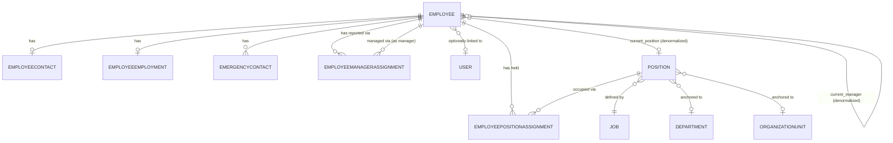

# Employee Architecture

Status: **Implemented (Phase 04)**. Related: [ADR-020](../adr/ADR-020-employee-identity-model.md) through [ADR-023](../adr/ADR-023-employee-lifecycle-and-status.md), [docs/domain/employee.md](../domain/employee.md).

## Layering

```
URL (apps/employees/urls.py, app_name="employees")
  ↓
CBV (apps/employees/views/*.py — every view is class-based)
  ↓                                    ↓
Form (apps/employees/forms/*.py)    Selector (apps/employees/selectors.py)
  ↓                                    ↓
Service (apps/employees/services/*.py) — validate → transaction.atomic() → write → audit
  ↓
PostgreSQL (constraints: partial UniqueConstraint, CheckConstraint, PROTECT/SET_NULL)
```

Identical pattern to `apps/organization` (Phase 03) and `apps/theme` (Phase 02) — `apps/core/mixins.py`'s `PublicIDLookupMixin`, `HtmxTemplateMixin`, `HtmxRedirectMixin` are reused unchanged.

## Entity-relationship diagram



`Employee.current_position`/`current_manager` are shown separately from the assignment tables because they're synchronized *pointers*, not the source of truth — see ADR-022.

## Database schema

| Model | Key fields | Relationships | Constraints | Indexes |
|---|---|---|---|---|
| `Employee` | employee_number, name fields, DOB, gender, nationality, marital_status, profile_photo | user→User (SET_NULL, nullable, 1:1), current_position→Position (PROTECT, nullable), current_manager→self (SET_NULL, nullable) | unique(employee_number) | employee_number, (last_name, first_name), current_position, current_manager |
| `EmployeeContact` | personal_email, work_email, mobile/phone, address fields | employee→Employee (CASCADE, 1:1) | unique(work_email) where non-blank | — |
| `EmployeeEmployment` | joining_date, employment_type, status, probation/confirmation/termination dates | employee→Employee (CASCADE, 1:1) | check(termination_date ≥ joining_date); check(probation_end_date ≥ joining_date) | status |
| `EmergencyContact` | name, relationship, mobile, email, address, is_primary | employee→Employee (CASCADE) | unique(employee) where is_primary | employee |
| `EmployeePositionAssignment` | assignment_type, is_primary, start_date, end_date, reason, notes | employee→Employee (CASCADE), position→Position (PROTECT) | unique(employee) where (is_primary AND end_date IS NULL); check(end_date ≥ start_date) | employee, position, (employee, is_primary, end_date) |
| `EmployeeManagerAssignment` | relationship_type, is_primary, start_date, end_date | employee→Employee (CASCADE), manager→Employee (PROTECT) | unique(employee) where (is_primary AND end_date IS NULL); check(end_date ≥ start_date); check(employee ≠ manager) | employee, manager, (employee, is_primary, end_date) |
| `EmployeeNumberSequence` | last_value | — (singleton, pk=1) | — | — |

## CBV inventory (21 routed views + 2 unrouted shared bases = 23 classes)

| View | Base CBV | Purpose | Permission |
|---|---|---|---|
| `EmployeeDashboardView` | TemplateView | KPIs | view_employee |
| `EmployeeListView/DetailView/CreateView/UpdateView/DeleteView` | List/Detail/FormView/FormView/DeleteView | CRUD (Create/Update use FormView — plain Forms spanning Employee+Contact) | view/add/change/delete_employee |
| `EmployeeActivateView/ConfirmView/PlaceOnLeaveView/ReturnFromLeaveView/SuspendView/ReinstateView` | FormView (via shared `_EmployeeTransitionView`) | Lifecycle transitions | change_employee |
| `EmployeeDeactivateView` | FormView | Terminal transition (status + effective_date + reason) | change_employee |
| `EmployeeAssignmentCreateView/UpdateView/EndView` | FormView (via shared `_EmployeeScopedFormView`) | Secondary assignment / primary position change / end an assignment | change_employee |
| `EmployeeManagerAssignmentView` | FormView | Change manager | change_employee |
| `MyProfileView` | DetailView | Self-service — NOT permission-gated the same way; resolves via the logged-in user's own linked record | LoginRequiredMixin only |
| `EmployeeUserLinkView/UnlinkView` | FormView | Link/unlink a login account | change_employee |
| `EmployeeHistoryView` | DetailView | Assignment + manager + audit history | view_employee |

**Zero function-based application views.** See the FBV audit in the Phase 04 final report.

## Service inventory

| Service | Purpose |
|---|---|
| `EmployeeNumberService.generate()` | Concurrency-safe business identifier (ADR-021) |
| `EmployeeService.create_employee/update_employee` | Identity + contact writes; never touches employment status |
| `EmployeeLifecycleService.activate/confirm/place_on_leave/return_from_leave/suspend/reinstate/deactivate` | The 7-transition state model (ADR-023) |
| `EmployeeAssignmentService.assign_position/end_assignment` | Position assignment writes; owns ending the previous primary + syncing `current_position` |
| `EmployeeManagerService.assign_manager/end_manager_assignment` | Manager assignment writes; owns ending the previous primary + syncing `current_manager`, cycle-checked |
| `EmployeeUserLinkService.link_user/unlink_user` | Explicit User linking |

## Selector inventory

`get_employees_for_list`, `get_employee_by_public_id`, `get_employee_by_number`, `get_my_profile`, `get_assignment_history`, `get_current_assignments`, `get_manager_history`, `get_subordinates`, `get_active_employees`, `get_new_joiners`, `get_employee_headcount`, `get_employee_dashboard_metrics` — all in `apps/employees/selectors.py`, all scope-restricted via `apps.employees.permissions` except where explicitly self-scoped (`get_my_profile`).

## Authorization

`apps/employees/permissions.py` reuses `apps.organization.permissions.restrict_by_organization` directly rather than reimplementing subtree resolution. Two functions:

- `restrict_employees_by_organization()` — list scope, identical shape to organization app's own scoping.
- `restrict_employees_for_detail()` — the same scope, OR'd with `Q(user_id=<viewer>)` so a viewer can always reach their own record regardless of organization scope (Phase 04 brief §47). Combining an already-`.distinct()`-flagged queryset with a plain `.filter()` via `|` raises `TypeError` in Django unless both sides carry the same `distinct` flag — a real bug caught by `apps/employees/tests/test_selectors.py` while building this, fixed by explicitly `.distinct()`-ing both branches before combining.

An employee with no organization scope and no `view_employee` permission still reaches `MyProfileView` (`/employees/me/`), which is gated only on `LoginRequiredMixin`, not `PermissionRequiredMixin` — deliberately, since a restaurant crew member with zero HR permissions must still see their own profile.
