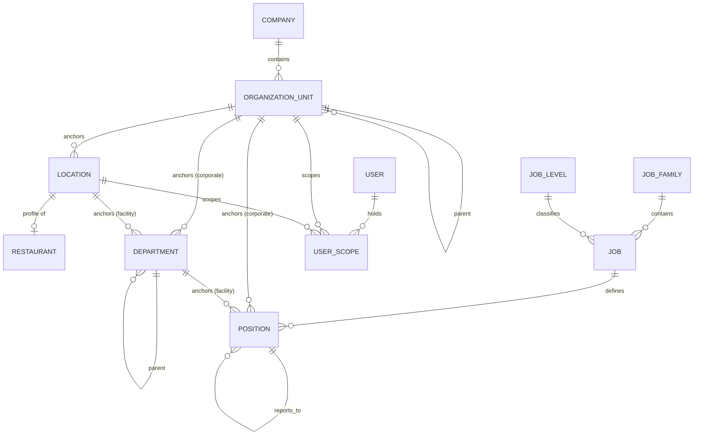

# Organization Architecture

Status: **Implemented (Phase 03)**. Related: [ADR-016](../adr/ADR-016-organization-hierarchy.md), [ADR-017](../adr/ADR-017-job-vs-position.md), [ADR-018](../adr/ADR-018-organizational-access-scoping.md), [ADR-019](../adr/ADR-019-position-headcount-architecture.md), [docs/domain/organization.md](../domain/organization.md).

## Layering

```
URL (apps/organization/urls.py, app_name="organization")
  ↓
CBV (apps/organization/views/*.py — every view is class-based, no exceptions)
  ↓                                    ↓
Form (apps/organization/forms.py)   Selector (apps/organization/selectors.py)
  ↓                                    ↓
Service (apps/organization/services.py) — validate → transaction.atomic() → write → audit
  ↓
PostgreSQL (constraints: UniqueConstraint, CheckConstraint, PROTECT)
```

Identical to the pattern established in Phase 02 for `apps/theme` — `apps/core/mixins.py`'s `PublicIDLookupMixin`, `HtmxTemplateMixin`, `HtmxRedirectMixin` are reused unchanged, no new mixins were needed.

## Entity-relationship diagram



`Department` and `Position` each show two possible anchor relationships (organization_unit OR location/department) because they're mutually-exclusive-or-alternative anchors, not both-required — see ADR-016/017 for why.

## Database schema

| Model | Key fields | Relationships | Constraints | Indexes |
|---|---|---|---|---|
| `Company` | name, legal_name, code, slug, is_active | — | unique(name), unique(code), unique(slug) | — |
| `OrganizationUnit` | name, code, unit_type, sort_order, is_active | company→Company (PROTECT), parent→self (PROTECT) | unique(company, code) | parent, is_active, (company, unit_type) |
| `Location` | code, name, location_type, address/city/district/province/postal_code, lat/long, phone/email, opened_on/closed_on, is_active | organization_unit→OrganizationUnit (PROTECT) | unique(code); check(closed_on ≥ opened_on) | location_type, is_active, organization_unit |
| `Restaurant` | restaurant_number, restaurant_type, operational_status, opening_date/closing_date | location→Location (OneToOne, PROTECT) | unique(restaurant_number); check(closing_date ≥ opening_date) | restaurant_number, operational_status |
| `Department` | code, name, description, is_active | organization_unit→OrganizationUnit (PROTECT, nullable), location→Location (PROTECT, nullable), parent→self (PROTECT) | check(exactly one of organization_unit/location) | code, parent |
| `JobFamily` | code, name, is_active | — | unique(code) | — |
| `JobLevel` | code, name, rank, is_active | — | unique(code), unique(rank) | — |
| `Job` | code, title, employment_category, is_active | job_family→JobFamily (PROTECT), job_level→JobLevel (PROTECT) | unique(code) | job_family, job_level, code |
| `Position` | code, title, position_type, status, headcount_limit, effective_from/to | job→Job (PROTECT), organization_unit→OrganizationUnit (PROTECT, nullable), department→Department (PROTECT, nullable), reports_to→self (SET_NULL) | unique(code); check(headcount_limit ≥ 1); check(effective_to ≥ effective_from) | code, status, department |
| `UserScope` (apps.accounts) | scope_type | user→User (CASCADE), organization_unit→OrganizationUnit (CASCADE, nullable), location→Location (CASCADE, nullable) | check(fields match scope_type) | (user, scope_type) |

## CBV inventory

| View | Base CBV | Purpose | Permission | HTMX |
|---|---|---|---|---|
| `OrganizationDashboardView` | TemplateView | KPIs + org tree | view_organizationunit | No (tree children load via a separate HTMX view) |
| `OrganizationUnitChildrenView` | View | Lazy-load one tree node's children | view_organizationunit | Yes (the only consumer) |
| `OrganizationUnitListView/DetailView/CreateView/UpdateView/DeleteView` | List/Detail/Create/Update/DeleteView | Org unit CRUD | view/add/change/delete_organizationunit | Yes |
| `LocationListView/DetailView/CreateView/UpdateView/DeleteView` | List/Detail/Create/Update/DeleteView | Facility CRUD | view/add/change/delete_location | Yes |
| `RestaurantListView/DetailView/CreateView/UpdateView/DeleteView` | List/Detail/**FormView**/**FormView**/DeleteView | Restaurant CRUD (Create/Update span Location+Restaurant, so FormView not CreateView/UpdateView) | view/add/change/delete_restaurant | Yes |
| `DepartmentListView/DetailView/CreateView/UpdateView/DeleteView` | List/Detail/Create/Update/DeleteView | Department CRUD | view/add/change/delete_department | Yes |
| `JobFamilyListView/DetailView/CreateView/UpdateView/DeleteView` | List/Detail/Create/Update/DeleteView | Job family CRUD (no service layer — plain CRUD) | view/add/change/delete_jobfamily | Yes |
| `JobLevelListView/DetailView/CreateView/UpdateView/DeleteView` | List/Detail/Create/Update/DeleteView | Job level CRUD | view/add/change/delete_joblevel | Yes |
| `JobListView/DetailView/CreateView/UpdateView/DeleteView` | List/Detail/Create/Update/DeleteView | Job CRUD | view/add/change/delete_job | Yes |
| `PositionListView/DetailView/CreateView/UpdateView/DeleteView` | List/Detail/Create/Update/DeleteView | Position CRUD | view/add/change/delete_position | Yes |
| `PositionActivateView/DeactivateView/FreezeView/UnfreezeView/DuplicateView` | FormView | Lifecycle workflows | change_position (add_position for Duplicate) | Yes |

47 CBVs total (verified via AST parse of `apps/organization/views/*.py`). **Zero function-based application views** — see the FBV audit in the Phase 03 final report and the permanent regression test at `tests/test_no_fbvs.py`.

## Service inventory

| Service | Purpose | Transaction boundary | Audit |
|---|---|---|---|
| `create_organization_unit` / `update_organization_unit` | Hierarchy validation + write | `transaction.atomic()` | `organization_unit.created` / `.updated` |
| `create_restaurant` / `update_restaurant` | Multi-model (Location+Restaurant) write | `transaction.atomic()` | `restaurant.created` / `.updated` / `.status_changed` |
| `create_department` / `update_department` | Dual-anchor validation + write | `transaction.atomic()` | `department.created` / `.updated` |
| `create_position` / `update_position` | Anchor + cycle validation + write | `transaction.atomic()` | `position.created` / `.updated` |
| `activate_position` / `deactivate_position` / `freeze_position` / `unfreeze_position` | Status-transition validation | `transaction.atomic()` | `position.activated` / `.deactivated` / `.frozen` / `.unfrozen` |
| `duplicate_position` | New DRAFT copy | `transaction.atomic()` | `position.duplicated` |

`JobFamily`/`JobLevel`/`Job` have **no service layer** — genuinely plain single-model CRUD with no extra business rule, matching the project's own standard for when a service is (and isn't) justified.

## Selector inventory

| Selector | Purpose | Optimization |
|---|---|---|
| `get_organization_units_for_list` / `get_root_units_for_user` / `get_child_units` | Scoped unit reads, tree traversal | `select_related("parent", "company")` |
| `get_locations_for_list` / `get_active_locations` | Scoped facility reads | `select_related("organization_unit")` |
| `get_restaurants_for_list` / `get_active_restaurants` | Scoped restaurant reads | `select_related("location", "location__organization_unit")` |
| `get_departments_for_list` / `get_department_positions` | Scoped department reads | `select_related("organization_unit", "location", "parent")` |
| `get_job_families_for_list` / `get_job_levels_for_list` / `get_jobs_for_list` | Global master-data reads (unscoped) | `select_related("job_family", "job_level")` |
| `get_positions_for_list` / `get_vacant_positions` / `get_position_headcount_summary` | Scoped position reads + aggregates | `select_related(...)`, `aggregate(Sum, Count)` |
| `get_organization_dashboard_metrics` | Dashboard KPIs | Composes the above `.count()`/aggregate calls |

Every scoped selector routes through `apps/organization/permissions.py:restrict_by_organization()` — see ADR-018.
