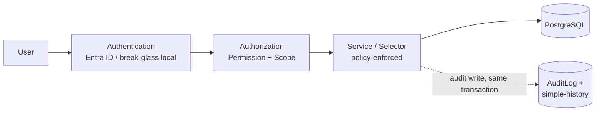

# Security Architecture

## 1. Overview

EMS is the system of record for McDonald's Pakistan's most sensitive employee data: personal information, national identification documents, contact details, salary, performance reviews, employment history, attendance, leave, and disciplinary records. Security is not a bolt-on feature of this system — it is the reason several architectural decisions elsewhere in this package look the way they do (e.g. why `compensation` is its own Django app rather than fields on `Employee`; see [application-architecture.md](./application-architecture.md) and [django-app-map.md](./django-app-map.md)).

This document is the entry point for the security architecture. It states the overall shape of the design and how its pieces fit together; each pillar has its own deep-dive document:

- **[Authentication](../security/authentication.md)** — how a user proves who they are (Microsoft Entra ID via `django-allauth`, break-glass local fallback, session policy, MFA boundary).
- **[Authorization](../security/authorization.md)** — how the system decides what an authenticated user is allowed to see and do (Django Groups/Permissions + `UserScope`, `policies.py` convention, enforcement layering).
- **[Audit](../security/audit.md)** — how changes and sensitive actions are recorded, and how that record is protected from tampering (`django-simple-history` + custom `AuditLog`).

## 2. The Security Model in One Picture

Every request that reaches business logic passes through the same chain, regardless of which app it touches:

Authentication establishes *who* is asking (see [authentication.md](../security/authentication.md)). Authorization establishes *what that identity is allowed to reach*, combining a Django permission (what capability) with a `UserScope` (what part of the org) — see [authorization.md](../security/authorization.md). Every write that authorization allows is recorded, in the same transaction as the change itself, so there is never a window where a sensitive mutation exists without an audit trail — see [audit.md](../security/audit.md). None of these three pillars is optional or independently disable-able; they are designed to be exercised together on every request.

## 3. Design Principles

1. **Trust the IdP for identity, not for authorization.** Entra ID (and its Conditional Access/MFA policy) answers "is this really this person," including MFA. EMS answers "what can this person see and do" itself — that logic is domain-specific (org hierarchy, HR sensitivity tiers) and does not belong upstream in the IdP.
2. **Permission and scope are independent axes, always both checked.** A Django permission alone never grants access to a specific record; a `UserScope` alone never grants a capability. Both must hold. This is what makes "Restaurant Manager sees employees, not salaries" a natural consequence of the model rather than a special case (worked through in full in [authorization.md](../security/authorization.md)).
3. **Enforce at the data layer, not just the presentation layer.** Selectors and services are the actual security boundary; views and templates add UX polish (fast 403s, hidden buttons) on top but are never the only thing standing between a user and data they shouldn't see. See the "Enforcement Points" section of [authorization.md](../security/authorization.md).
4. **Sensitive categories get separate permissions and separate apps, not conditionals.** Compensation, documents, and disciplinary data are modeled as their own apps with their own permissions specifically so that a view built for a less-sensitive domain (e.g. the general employee list) has no code path that can accidentally expose them.
5. **Every sensitive mutation is auditable, and the audit write cannot be separated from the mutation it describes.** See the transaction-boundary rule in [audit.md](../security/audit.md).
6. **Logs and audit trails are not the same thing, and have different content rules** (Section 4 below).

## 4. Data Privacy / PII Handling

### 4.1 Data Categories and Access Posture

| Data category | Default visibility | Gating permission | Logging restriction |
|---|---|---|---|
| **Personal information** (name, DOB, national ID) | HR; own record (SELF); manager chain sees only limited fields (name, photo, position) — **not** national ID | `employees.view_employee` (limited-field view for manager chain is a selector-level projection, not a separate permission) | National ID never appears in application logs |
| **Contact information** | Same posture as personal information | `employees.view_employee` | Not logged in plaintext in application logs |
| **Identification documents** (CNIC copies, etc.) | HR / Compliance only | `documents.view_document` (separate `documents` app) | Document contents never logged; only entity `public_id` and action type |
| **Salary / compensation** | Payroll / HR / executive scope only — never in general employee list views or exports without this permission | `compensation.view_compensation` (separate `compensation` app, separate from `employees.view_employee`) | Salary figures never appear in application logs; only in restricted-access `AuditLog` old/new-value snapshots |
| **Performance reviews** | Manager chain + HR; employee sees own | `performance.view_review` | No review content in application logs |
| **Employment history** (positions, transfers, tenure) | Broad internal visibility — an org chart is not itself sensitive | `employees.view_employee` | Standard logging restrictions apply; compensation history stays gated separately even though position history is broadly visible |
| **Attendance / leave** | Manager chain (own restaurant/department) + HR + employee (own) | `attendance.view_attendance` / `leave.view_leaverequest` | No special restriction beyond standard PII handling |
| **Disciplinary information** | HR + directly involved manager only — most restrictive category alongside salary and ID documents | `discipline.view_disciplinaryaction` | Disciplinary detail never appears in application logs; only in restricted `AuditLog` entries |

This table is the source of truth for which permission gates which category; the mechanics of how permission + scope combine are in [authorization.md](../security/authorization.md).

### 4.2 Encryption

- **In transit:** TLS everywhere, non-negotiable. Covered in the deployment architecture document, not repeated here.
- **At rest:** relies on the managed database/storage service's native encryption-at-rest rather than application-level field encryption for most data. **Assumption:** hosted on Azure, where Azure Database for PostgreSQL and Azure Blob Storage both provide encryption at rest by default.
- **Exception — national ID / CNIC numbers:** given their sensitivity as a national identifier (and the outsized harm of exposure relative to most other fields), CNIC numbers should get **application-level encryption** — e.g. a custom encrypted model field, or a `django-cryptography`-style approach — on top of the storage layer's encryption. This is documented as **Recommended, not yet Required**, pending a Phase 01 data classification sign-off that would make it a formal requirement.

### 4.3 Retention

Retention periods are defined per data category in `../database/data-lifecycle.md` (owned by the data architecture workstream) — this document does not duplicate that content, only cross-references it. Two items specific to this document's scope:

- Historical/audit data retention (how long `AuditLog` and `django-simple-history` rows are kept) is addressed in `../database/data-lifecycle.md`.
- Documents (ID scans, contracts) need a defined retention/purge policy aligned to Pakistani labor law record-keeping requirements. **This is marked as requiring Legal/Compliance sign-off — a Phase 01 prerequisite.** No specific legal retention period is asserted in this architecture package; one must be sourced from Legal/Compliance before `documents` retention rules are implemented.

### 4.4 Logging vs. Audit — the Distinction

Two different systems record "what happened," with different rules:

- **Application logs** (structured logs, error tracking/APM) exist for operational debugging. They must **never** include salary figures, national ID numbers, or full document contents. They log entity identifiers (`public_id`) and action types — e.g. `"salary_changed entity=EMP-00123"` — never the values themselves.
- **`AuditLog` entries** (see [audit.md](../security/audit.md)) exist for legitimate audit/compliance purposes and **do** capture old/new field values for the specific fields relevant to a business event, by design. This table lives behind its own restricted `view` permission (see Section 4.1 — audit viewing is HR Security/Compliance and System Admin only, scope-filtered) and is not part of general application logging or error tracking.

The distinction matters operationally: a log aggregation/APM tool (which may have broader internal access, third-party log shipping, or longer casual retention) must never become a second, unaudited copy of sensitive field values. Anything that needs old/new-value tracking goes through `AuditLog`, not through `logger.info(...)`.

## 5. Secrets Management

- All secrets (Entra ID client ID/secret, database credentials, Redis connection string, Django `SECRET_KEY`, any third-party API keys) are supplied via environment variables, read through `django-environ` (or equivalent), never hard-coded in source.
- Secrets are never committed to version control. `.env` files used for local development are git-ignored; example/template files (`.env.example`) contain placeholder values only.
- Deployment environments (staging, production) inject secrets via the hosting platform's secret store (e.g. Azure App Service configuration / Azure Key Vault references) rather than baked into container images or checked-in config files.
- **No secrets are stored in the application database**, with one deliberate, documented exception: business data that is itself sensitive enough to warrant application-level encryption at rest — namely CNIC numbers (Section 4.2) — which are encrypted-in-place using an application-managed key, not treated as a "secret" in the credential sense but handled with equivalent care (key stored outside the database, e.g. in the same secret store as other credentials).
- Rotation of IdP client secrets, database credentials, and encryption keys is an operational/runbook concern for Phase 01 infrastructure setup, not a code-level control documented further here.

## 6. Summary of Cross-References

| Topic | Document |
|---|---|
| How identity is established, session policy, MFA boundary | [../security/authentication.md](../security/authentication.md) |
| Permission + scope model, `policies.py`, enforcement layering, worked example | [../security/authorization.md](../security/authorization.md) |
| Field-level history vs. business-event audit log, tamper resistance, action-to-service mapping | [../security/audit.md](../security/audit.md) |
| Retention periods for historical/audit data | `../database/data-lifecycle.md` |
| App boundaries that this security model depends on (e.g. `compensation` separate from `employees`) | [application-architecture.md](./application-architecture.md), [django-app-map.md](./django-app-map.md) |
