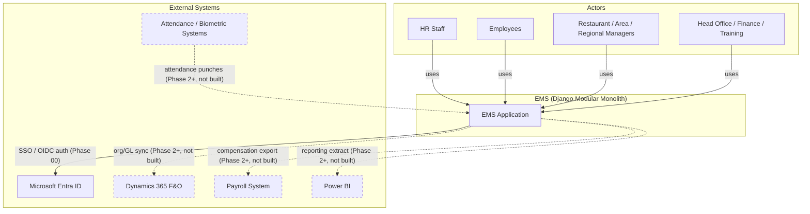

# System Architecture

## 1. Overview

The Employee Management System (EMS) is a server-rendered Django application built for McDonald's Pakistan to replace Excel-based and manual HR/operations workflows. It is the system of record for employee identity, organizational assignment, compensation, attendance, leave, performance, training, recruitment, and the documents and workflows that connect them.

**Primary users:**

- **HR** — administers employee records, org structure, documents, and policy-driven workflows.
- **Restaurant Operations** (Restaurant Managers/Shift Managers) — manage their restaurant's staff: attendance, leave approval, onboarding tasks.
- **Area Management** — oversees a cluster of restaurants within a region; approval and visibility scoped to their area.
- **Regional Management** — oversees multiple areas; broader approval and reporting scope.
- **Head Office** — cross-region policy, reporting, and configuration (including theming and system settings).
- **Finance / Payroll** — compensation and benefits data, isolated from general employee visibility.
- **Training** — course catalog, completions, certification expiry tracking.
- **Management** (senior leadership) — dashboards and aggregate analytics.
- **Employees** — self-service: personal profile, leave requests, payslip/document visibility (where permitted), training records.

**Scale assumption (assumption, pending sign-off):** low thousands of employees, hundreds of concurrent named users, hundreds of restaurants organized across regions and areas. These figures drive indexing, caching, and pagination choices throughout this package but are not confirmed capacity commitments.

## 2. Architectural Style: Modular Monolith

EMS is a **single Django project** composed of independently-boundaried **apps** under `apps/<domain>/` (see [django-app-map.md](./django-app-map.md) for the full app inventory and dependency graph). A modular monolith was chosen over a microservices decomposition because:

- The scale assumption above does not justify the operational cost of independently deployed services (service discovery, distributed transactions, network-boundary latency, multi-service on-call).
- A single Postgres database allows relational integrity (foreign keys, exclusion constraints) across HR domains that are inherently relational (a leave request references an employee, which references an assignment, which references a restaurant).
- App boundaries are deliberately kept clean — each app exposes only `services.py` (writes) and `selectors.py` (reads) as its public surface — so that a genuinely independent domain (e.g. `attendance`, if biometric integration volume grows enormously) could be extracted into its own service later without a rewrite, if that ever becomes justified.

**The one hard rule that keeps this option open:** no app is permitted to reach across another app's ORM boundary. A view or service in `leave` never does `Employee.objects.filter(...)` directly — it calls `employees.selectors.get_employee(...)`. This is enforced by convention and code review now; see [application-architecture.md](./application-architecture.md) for the full layering contract.

## 3. Layered Request Flow

Every request that touches business logic passes through the same four layers, in the same order:

```
Views  →  Services / Selectors  →  Django ORM  →  PostgreSQL
```

- **Views** are thin: parse the request, resolve the acting user, call exactly one service (for a write) or selector (for a read), and render a template or HTMX partial. Views never contain business rules and never issue direct multi-model writes.
- **Services** (`services.py`) contain all write-side business logic: policy checks, validation, multi-model transactional writes, audit logging, and signal dispatch.
- **Selectors** (`selectors.py`) contain all read-side query logic: scope filtering, `select_related`/`prefetch_related`, and shaping querysets for views and dashboards.
- **PostgreSQL** is the single source of truth, relied upon directly for integrity guarantees (exclusion constraints, unique constraints) rather than only application-level validation.

Business logic is never embedded in templates — templates render context that services/selectors have already fully computed and authorized. Full detail on this contract, transaction boundaries, and the HTMX/Alpine conventions is in [application-architecture.md](./application-architecture.md).

## 4. System Context

The diagram below shows EMS's actors and its relationship to external systems. **Only Microsoft Entra ID is integrated in the initial phases** (authentication). All other external integrations (Dynamics 365 F&O, Payroll, Attendance/Biometric hardware, Power BI) are **Phase 2+** — architected for (see [django-app-map.md](./django-app-map.md) `integrations` app) but not built in Phase 00/01.



Solid arrows are in scope now; dashed arrows are future integration points owned by the `integrations` app boundary (external IDs are mapped via `ExternalIdentifier`, never used as primary keys — see [django-app-map.md](./django-app-map.md)).

## 5. Non-Functional Requirements

### 5.1 Security Posture

- Authentication via Microsoft Entra ID (OIDC) through django-allauth, with a local-account fallback for non-Entra users (e.g. vendor/service accounts). See `accounts` app.
- Authorization is two-layered: Django Groups/Permissions for coarse capability grants, plus a `UserScope` (GLOBAL/REGION/AREA/RESTAURANT/DEPARTMENT/SELF) layer for data-scoped access, enforced in every selector and service — never in templates. Full detail: [../security/authorization.md](../security/authorization.md).
- Compensation data visibility is a permission fully independent of employee-record visibility (a Restaurant Manager who can see their staff cannot necessarily see salaries) — enforced by keeping `compensation` a separate app from `employees`.
- Brute-force login protection via django-axes; failed logins are recorded as audit events.
- All sensitive/historical models carry field-level history (django-simple-history) and business-event audit logging (`audit` app) — see [../security/audit-logging.md](../security/audit-logging.md) (cross-reference; detailed content owned by the security package).
- Public-facing identifiers use `public_id` (UUID4), never the integer primary key, on any URL- or API-exposed model, to prevent headcount enumeration. See [django-app-map.md](./django-app-map.md) and the data model conventions in [../database](../database).

### 5.2 Performance Targets (assumption, pending sign-off)

- Server-rendered list views: **p95 < 500ms** under normal load, for the scale assumption in §1.
- Dashboard/aggregate views may be cached (short TTL, e.g. 1–5 minutes) rather than computed live on every request, given they aggregate across hundreds of restaurants.
- HTMX partial updates (e.g. inline approve/reject) target sub-200ms server time since they update a small DOM fragment, not a full page.
- These are design targets to validate against, not contractual SLAs, until confirmed with the business.

### 5.3 Scalability Targets

- Thousands of employees (current + historical, including rehires — each rehire is a new `Employee` stint against the same `Person`).
- Hundreds of concurrent named users across regions/areas.
- Multi-year retention of historical and attendance data — the primary reason every model uses a compact `BigAutoField` integer primary key rather than UUID-as-PK: attendance and history tables are expected to reach millions of rows over several years, and 8-byte integer FK indexes matter at that volume. See [django-app-map.md](./django-app-map.md) and [../database](../database) for the full primary-key rationale.
- Redis-backed caching and sessions are required from day one (also the backing store for Celery once background processing is wired in — see [application-architecture.md](./application-architecture.md)).

### 5.4 Maintainability Principles

- Strict view/service/selector layering (§3) keeps business logic discoverable in exactly one place per app.
- One Django project, many apps — no premature service extraction, but clean enough boundaries (`services.py`/`selectors.py` as the only public surface) that extraction remains possible.
- Tailwind utility classes are fixed and static; the runtime theme system only ever changes CSS custom-property *values*, never generates new class names, so the maintainable surface of the frontend never grows unbounded (see `theme` app, [django-app-map.md](./django-app-map.md)).
- No generic workflow engine until at least three workflows demonstrably need divergent branching logic — avoids speculative complexity (see `workflows` app).
- No API layer (DRF or otherwise) until a concrete external consumer exists — avoids maintaining an unused contract surface.

## 6. Data Privacy Categories

The categories below summarize the sensitivity classes handled by EMS. Access-control detail (permissions, scopes, field-level restrictions) is owned by [../security/data-classification.md](../security/data-classification.md) and [../security/authorization.md](../security/authorization.md) — this table is an overview only.

| Category | Examples | Access-restriction philosophy |
|---|---|---|
| Personal Information | Name, DOB, gender, marital status | Visible within the viewer's org scope; full detail restricted to HR/Self. |
| Contact Information | Phone, address, personal email | Restricted to HR, direct manager (scoped), and the employee themselves (Self). |
| Identification Documents | National ID (CNIC), passport, work permit | HR-only by default; never rendered in list views, only detail views with an access log entry. |
| Salary / Compensation | Base pay, allowances, benefits | Isolated permission (`view_compensation`) entirely separate from general employee visibility — see `compensation` app. |
| Performance | Reviews, goals/KPIs, ratings | Visible to the employee, their manager chain (scoped), and HR — not to peers. |
| Employment History | Assignment, transfer, promotion history | Visible within org scope for operational purposes; effective-dated and immutable once past-dated. |
| Attendance | Punches, shift records | Restaurant-scoped for managers; self-visible to the employee; aggregate-only beyond area scope. |
| Leave | Requests, balances, approval trail | Visible to employee, approving manager chain, and HR; balances are self-visible. |
| Disciplinary Information | Warnings, incident records | Most restrictive tier — HR and specifically authorized management only, always audit-logged on access. |

## 7. Related Documents

- [application-architecture.md](./application-architecture.md) — layering contract, request lifecycle, HTMX/Alpine conventions.
- [domain-architecture.md](./domain-architecture.md) — functional domain reference (17 domains).
- [django-app-map.md](./django-app-map.md) — app-by-app responsibility, model ownership, and dependency graph.
- [../security](../security) — authorization, data classification, and audit-logging detail.
- [../database](../database) — schema and primary-key/effective-dating conventions.
