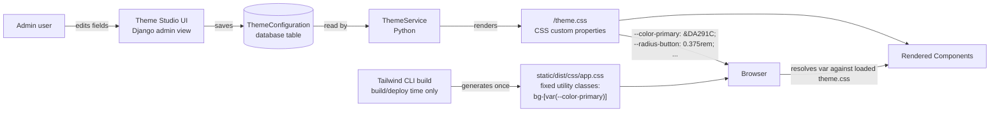

# Theme Architecture

Status: Final (Phase 01 baseline) — this document satisfies the brief's **CRITICAL REQUIREMENT — DYNAMIC THEME SYSTEM**.
Audience: Architects and engineers implementing theming for the Django-based EMS.

Related documents:
- [Frontend Architecture](frontend-architecture.md)
- [Design System](../frontend/design-system.md)
- [Theme System — implementation mechanics](../frontend/theme-system.md)

---

## 1. The Requirement

The entire visual theme — colors, typography, layout, components, and light/dark/system appearance — must be **admin-configurable from the database, without modifying source code or rebuilding Tailwind CSS**. A non-technical admin using a "Theme Studio" screen must be able to change, for example, the primary brand color, and see it reflected across the whole application immediately, without a deploy.

## 2. The Core Problem: Tailwind is a Build-Time Tool

Tailwind CSS's JIT engine works by **scanning source files (templates, and optionally `.py`/`.js` files) for literal class name strings**, and generating CSS rules only for the class names it finds. This scan happens **at build time** (`tailwindcss ... --minify`, run in CI/deploy), not at request time.

This means:

- If a database value said `"primary_color_class": "bg-red-700"`, and an admin changed it to `"bg-blue-600"`, Tailwind would not do anything wrong *if* `bg-blue-600` happened to already exist in the built CSS — but the moment an admin picks a color that doesn't map to a **pre-generated** Tailwind class (any arbitrary hex value, which is the entire point of a color picker), there is no corresponding CSS rule in `app.css`. The browser would apply a class that resolves to nothing. **It is architecturally impossible for a database value to safely generate a brand-new, arbitrary Tailwind utility class at runtime** — Tailwind simply never saw that string at scan time, so it silently does nothing.
- Rebuilding Tailwind on every theme change (i.e., running the CLI build as a side effect of an admin saving a form) is rejected: it requires shelling out to Node tooling from a web request, is slow, fragile in production, and does not scale to per-tenant or frequently-changed themes.
- Storing entire pre-built alternate stylesheets per theme (one Tailwind build per possible theme) is rejected: colors are effectively continuous (hex values from a color picker), so the number of possible "themes" is unbounded — this cannot be enumerated at build time.

## 3. The Accepted Solution: CSS Custom Property Indirection

The theme system never asks Tailwind to generate new utility classes at runtime. Instead, it separates **which utility classes exist** (fixed, decided by engineers, generated once at build time) from **what those classes currently render as** (a runtime concern, resolved by the browser via CSS custom properties).

### The mechanism

1. Component templates use a **fixed, static set** of Tailwind's arbitrary-value utility classes that reference CSS custom properties, e.g.:
   ```html
   <button class="bg-[var(--color-primary)] hover:bg-[var(--color-primary-hover)]
                  text-[var(--color-text-on-primary)] rounded-[var(--radius-button)]
                  border border-[var(--color-border)]">
     Save
   </button>
   ```
   The **class name strings themselves** (`bg-[var(--color-primary)]`, `rounded-[var(--radius-button)]`, etc.) are written once by engineers in `templates/components/*` and never change. Because these strings are literally present in the template source, Tailwind's scanner finds them at build time and happily generates the corresponding CSS rules (`background-color: var(--color-primary)`, etc.) — this is ordinary, fully-supported Tailwind JIT behavior (arbitrary values), not a hack.
2. What changes at runtime is only the **value** that `--color-primary` resolves to — a CSS custom property declared on `:root` in a small, separately-served stylesheet.
3. That stylesheet is generated from the database, on demand, by Django — not by Tailwind, and not by Node.

### The pipeline



- **Admin → Theme Studio**: a Django admin-style form (see [theme-system.md](../frontend/theme-system.md) §5 for the live-preview UX) with fields for every configurable token.
- **Database**: the single `ThemeConfiguration` model (typically one active row, or one per tenant/brand if multi-tenancy is introduced later) is the source of truth.
- **ThemeService**: a plain Python service (`ThemeService.render_css_variables(theme) -> str`) that turns a `ThemeConfiguration` instance into a block of `:root { --color-primary: ...; }` CSS text — pure string rendering, no Tailwind involved.
- **`/theme.css`**: a Django view that serves that rendered text with `Content-Type: text/css`, cached and cache-busted (see §5).
- **Tailwind's real build**: runs once at deploy time (per [frontend-architecture.md](frontend-architecture.md) §3), completely unaware that any of this exists — it just sees static strings like `bg-[var(--color-primary)]` in the templates and generates fixed CSS rules that say "this property's color comes from a CSS variable," which is exactly the seam the runtime layer plugs into.
- **Components**: at render time, the browser applies the fixed Tailwind rule (`background-color: var(--color-primary)`) and resolves `--color-primary` against whatever `/theme.css` most recently declared — no rebuild, no redeploy, immediate effect on next stylesheet load (or instantly for any already-rendered page once `/theme.css` is swapped, since CSS custom properties are live).

### Why this is safe and sufficient

- **No unbounded CSS growth**: production `app.css` contains exactly the utility classes referenced in templates, regardless of how many theme values exist or how often they change — because the *classes* never change, only variable *values* do (confirms the guarantee already stated in [frontend-architecture.md](frontend-architecture.md) §3).
- **No runtime Node/Tailwind invocation**: `/theme.css` is generated by ordinary Django/Python string rendering, safe to call on every request (with caching) or on a cache-miss after a theme save.
- **Admins get real freedom**: any hex color, any pixel/rem value, any font stack — because CSS variable *values* accept arbitrary strings; only Tailwind *class names* cannot be arbitrary at runtime, and admins never touch class names.
- **Engineers keep control of the design surface**: which properties are themeable is still decided by engineers (which CSS variables exist and which components reference them) — admins configure values within that surface, they cannot introduce a new visual mechanism (e.g. a new layout primitive) without an engineering change. This is the correct boundary: brand/appearance is admin-configurable, structure and interaction are not.

---

## 4. Configurable Theme Areas

Every token below has a **light** and a **dark** value stored in `ThemeConfiguration` (see [theme-system.md](../frontend/theme-system.md) for the field list), enabling the System appearance mode. Defaults below are **placeholder values pending official McDonald's Pakistan brand guideline sign-off** — chosen to be tasteful and on-brand-adjacent (McDonald's red) but not to be treated as final brand color values.

### 4.1 Colors

| Token | CSS Variable | Default (Light) | Default (Dark) |
|---|---|---|---|
| Primary | `--color-primary` | `#DA291C` (McDonald's red, placeholder) | `#E5493C` |
| Primary hover | `--color-primary-hover` | `#B52117` | `#F16659` |
| Secondary | `--color-secondary` | `#FFC72C` (McDonald's gold, placeholder) | `#FFD35C` |
| Accent | `--color-accent` | `#27251F` (McDonald's dark, placeholder) | `#4A473F` |
| Background | `--color-background` | `#F7F7F5` | `#15161A` |
| Surface | `--color-surface` | `#FFFFFF` | `#1E2025` |
| Text primary | `--color-text-primary` | `#1A1A1A` | `#F2F2F2` |
| Text secondary | `--color-text-secondary` | `#5A5A5A` | `#A6A6A6` |
| Border | `--color-border` | `#E2E2E0` | `#33353B` |
| Success | `--color-success` | `#1E8E3E` | `#4CBB6E` |
| Warning | `--color-warning` | `#B8860B` | `#E0AC3C` |
| Danger | `--color-danger` | `#C62828` | `#E5534B` |
| Info | `--color-info` | `#1565C0` | `#5B9BE0` |

(Derived tokens such as `--color-text-on-primary` are also stored/derived for contrast-safe text on colored buttons.)

### 4.2 Typography

| Token | CSS Variable | Default |
|---|---|---|
| Font family | `--font-family-base` | `"Inter", ui-sans-serif, system-ui, sans-serif` |
| Base font size | `--font-size-base` | `0.9375rem` (15px) |
| Heading scale | `--font-scale-ratio` | `1.2` (used to derive `--font-size-h1`…`--font-size-h6`) |
| Font weight (normal) | `--font-weight-normal` | `400` |
| Font weight (medium) | `--font-weight-medium` | `500` |
| Font weight (bold) | `--font-weight-bold` | `700` |
| Line height | `--line-height-base` | `1.5` |

### 4.3 Layout

| Token | CSS Variable | Default |
|---|---|---|
| Sidebar width | `--layout-sidebar-width` | `16rem` |
| Sidebar position | `--layout-sidebar-position` | `left` (`left` \| `right`, stored as a discrete field, not a CSS var alone) |
| Navbar height | `--layout-navbar-height` | `3.5rem` |
| Content max width | `--layout-content-max-width` | `90rem` |
| Density | `--layout-density` | `comfortable` (`compact` \| `comfortable`) drives `--spacing-unit` |
| Compact mode spacing unit | `--spacing-unit` | `0.25rem` (comfortable) / `0.1875rem` (compact) |

### 4.4 Components

| Token | CSS Variable | Default |
|---|---|---|
| Button radius | `--radius-button` | `0.375rem` |
| Button shadow | `--shadow-button` | `0 1px 2px rgba(0,0,0,0.05)` |
| Card radius | `--radius-card` | `0.5rem` |
| Input radius | `--radius-input` | `0.375rem` |
| Table style | `--table-row-divider` | `1px solid var(--color-border)` |
| Badge radius | `--radius-badge` | `9999px` (pill) |
| Shadow (sm/md/lg) | `--shadow-sm` / `--shadow-md` / `--shadow-lg` | Tailwind default-equivalent shadow values |
| Border width | `--border-width-default` | `1px` |

### 4.5 Appearance

| Mode | Behavior |
|---|---|
| Light | Always uses the light value of every token. |
| Dark | Always uses the dark value of every token. |
| System | Two `:root` blocks are emitted in `/theme.css`: a default (light) block, and a `@media (prefers-color-scheme: dark)` block overriding every token with its dark value. The browser/OS decides which applies. |

An explicit per-user override (if the user picks Light/Dark in their own profile rather than following System) is layered on top by adding `data-theme="dark"`/`data-theme="light"` on `<html>` and scoping the dark overrides to `:root[data-theme="dark"]` in addition to the media query, so an explicit choice always wins over `prefers-color-scheme`. Full mechanics in [design-system.md](../frontend/design-system.md) §2.

---

## 5. `/theme.css` Endpoint Design

### Cache-busting strategy

Every save to `ThemeConfiguration` bumps a `version` value (an integer counter or an `updated_at` timestamp hashed to a short token). All templates reference the stylesheet through a template tag, never a hardcoded URL:

```html
<link rel="stylesheet" href="">
```

which renders as:

```html
<link rel="stylesheet" href="/theme.css?v=a1b2c3d4">
```

Because the query string changes whenever the theme changes, browsers and any intermediary/CDN cache never serve a stale stylesheet after a theme update, while still being free to cache aggressively for any given version.

### Response caching headers

- `Cache-Control: public, max-age=31536000, immutable` on the versioned URL (`/theme.css?v=<version>`) — safe because a given version's content never changes; a new version gets a new query string.
- The bare `/theme.css` (no query string, e.g. hit directly) is served with a short `Cache-Control: public, max-age=60` as a safety net for any caller that doesn't use the template tag.
- `ETag` is additionally set to the version token as a defense-in-depth for clients/proxies that revalidate rather than trusting `max-age`.

### Who can trigger regeneration

`/theme.css` is a **read-only, publicly cacheable GET endpoint** — it does not "regenerate" on request in the sense of doing expensive work; it renders quickly from the current `ThemeConfiguration` row (itself cached, see [theme-system.md](../frontend/theme-system.md)). The only action that changes its output is **saving** a `ThemeConfiguration`, which is restricted to users holding a dedicated `theme.manage_theme` permission (a superset of normal staff/admin access) — enforced in the Theme Studio view, not by obscurity. Regular admin users without this permission cannot alter the active theme even if they can access other Django admin areas.

### Fallback-to-default behavior

If no `ThemeConfiguration` row exists yet (first run, before any admin has visited Theme Studio), `ThemeService` falls back to a hardcoded `DEFAULT_THEME` dict matching the tables in §4, so `/theme.css` always returns a valid stylesheet and the application is never unstyled. In practice this scenario is avoided in every real environment because a default `ThemeConfiguration` row is seeded via a data migration/fixture at deploy time (see [theme-system.md](../frontend/theme-system.md) §6) — the in-code fallback exists purely as a defensive last resort (e.g. local dev before migrations are run), not as the primary mechanism.
