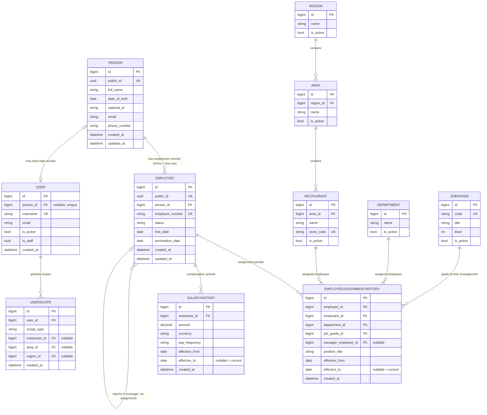

# Domain Model — Database Structure View

Status: Final (Phase 00 architecture package)
Related documents: [`./database-conventions.md`](./database-conventions.md) · [`./data-lifecycle.md`](./data-lifecycle.md)

This document covers the core entity relationships of EMS from a database-structure angle: what tables exist, how they relate, and — most importantly — *why* the schema is split the way it is. The full business/domain narrative (workflows, org processes) is covered elsewhere in the architecture package; this file focuses specifically on the identity model (Person/Employee/User) and the effective-dating chain (assignment/salary history), since both have non-obvious structural decisions behind them.

---

## 1. Entity-Relationship Diagram



> Diagram notes: `public_id` (UUID) is shown only on `PERSON` and `EMPLOYEE` — the URL/API-facing models per the PK strategy in [`./database-conventions.md`](./database-conventions.md#1-primary-key-strategy). `EMPLOYEEASSIGNMENTHISTORY` and `SALARYHISTORY` are internal history tables and intentionally have no `public_id`. The `manager_employee_id` FK on `EMPLOYEEASSIGNMENTHISTORY` is what encodes "reports to" — see §3.

---

## 2. The Person / Employee / User Split

EMS uses three distinct models rather than one monolithic "user profile" table. Each answers a different question, and conflating them causes real, recurring problems in HR systems as soon as rehire, non-employee accounts, or non-login employees show up — all three happen routinely at McDonald's Pakistan scale.

### 2.1 `Person` (app: `people`) — identity, once

`Person` holds a human being's identity and PII exactly once: name, date of birth, national ID, contact details. It exists independently of whether that person currently works for the company, has ever worked for the company, or has system login access.

### 2.2 `Employee` (app: `employees`) — one employment record per period of employment

`Employee` represents *a period of employment*, not a person. It FKs to `Person` (`on_delete=PROTECT`, non-nullable — every `Employee` row must resolve to exactly one `Person`), and carries the things that are true of *this employment*, not of the person in general: `employee_number` (unique), `status` (active/terminated/etc.), `hire_date`, `termination_date`.

```python
class Employee(CoreModel):
    public_id = models.UUIDField(default=uuid.uuid4, unique=True, editable=False, db_index=True)
    person = models.ForeignKey(
        "people.Person", on_delete=models.PROTECT, related_name="employments"
    )
    employee_number = models.CharField(max_length=20, unique=True)
    status = models.CharField(max_length=20, choices=EmployeeStatus.choices)
    hire_date = models.DateField()
    termination_date = models.DateField(null=True, blank=True)
```

**Rehire scenario, concretely:** Ahmed works at a Lahore restaurant, resigns, and is rehired 18 months later at a Karachi restaurant. This produces:

- One `Person` row for Ahmed (created once, at first hire, never duplicated).
- **Two** `Employee` rows, both FK'd to the same `Person` row — the first with `status=TERMINATED` and a `termination_date`, the second with a new `employee_number`, a new `hire_date`, and its own `status=ACTIVE`.

This is the entire reason `Employee` is a separate table from `Person`: without it, a rehire either (a) duplicates the person's PII in a new row, permanently splitting their identity and losing the link between their two employment stints, or (b) forces awkward "reactivate the old row and pretend the gap didn't happen" logic that destroys the historical fact that employment actually ended and restarted. With the split, rehire is simply "create a new `Employee` row pointing at the existing `Person`" — clean, queryable, and honest about what happened.

### 2.3 `User` (app: `accounts`, Django's auth model) — login access, optionally linked to a person

`User` is Django's authentication identity: username, password hash, permissions, `is_staff`/`is_active`. It optionally FKs to `Person` (`null=True`) — deliberately a loose, nullable link, because the two do not always coincide:

```python
class User(AbstractUser):
    person = models.OneToOneField(
        "people.Person",
        on_delete=models.SET_NULL,
        null=True,
        blank=True,
        related_name="user_account",
    )
```

**Non-employee-user scenario:** an external auditor or a Legal/Compliance reviewer needs read-only access to EMS reporting screens but has never been an employee — no `Person` row describes them in the HR sense, yet they need a `User` account. `User.person` is `NULL` for them.

**Non-login-employee scenario:** a restaurant crew member is a fully valid `Person` + `Employee` (they're on payroll, they have assignment and salary history) but never logs into EMS themselves — their manager or HR enters their data on their behalf. No `User` row exists for them at all, and none is required to.

`UserScope` (app: `accounts`) FKs to `User` (not `Employee`) and defines what part of the org a logged-in user can see/act on (a specific restaurant, an area, a region, or company-wide) — it's purely an authorization construct and correctly lives off of `User`, since authorization is about the login session, not the employment record.

### 2.4 Why three tables, summarized

| Question | Answered by |
|---|---|
| "Who is this human being?" | `Person` |
| "What employment period(s) has this person had, and what's their current status?" | `Employee` (1 or more per `Person`) |
| "Can this identity log into EMS, and with what permissions?" | `User` (0 or 1 per `Person`, and not every `User` has a `Person`) |

Collapsing any two of these into one table breaks one of the three scenarios above (rehire, non-employee accounts, non-login employees) — all of which are routine, expected occurrences in this domain, not edge cases to shrug off.

---

## 3. The Effective-Dated Assignment Chain

The business process this models: **Employee → Position → Restaurant Assignment → Manager → Department → Job Grade → Salary**, all of which can change over an employee's tenure (transfers, promotions, re-grading, manager changes, raises), and all of which need a full, queryable history — "where did this person work, in what role, under whom, on any given date in the past?"

### 3.1 One bundled table, not four independent ones

`EmployeeAssignmentHistory` (app: `employees`) captures **restaurant + department + position + manager together, as one row per effective period** — not as four separately effective-dated tables (one for restaurant assignment, one for department, one for position, one for manager).

```python
class EmployeeAssignmentHistory(CoreModel):
    employee = models.ForeignKey(
        "employees.Employee", on_delete=models.CASCADE, related_name="assignment_history"
    )
    restaurant = models.ForeignKey(
        "organization.Restaurant", on_delete=models.PROTECT, related_name="assignments"
    )
    department = models.ForeignKey(
        "organization.Department", on_delete=models.PROTECT, related_name="assignments"
    )
    job_grade = models.ForeignKey(
        "organization.JobGrade", on_delete=models.PROTECT, related_name="assignments"
    )
    manager = models.ForeignKey(
        "employees.Employee",
        on_delete=models.PROTECT,
        related_name="direct_report_assignments",
        null=True,
        blank=True,
    )
    position_title = models.CharField(max_length=150)
    effective_from = models.DateField()
    effective_to = models.DateField(null=True, blank=True)  # NULL = current/ongoing
```

**Why bundle them:** in practice, these four facts change *together*, as a unit, driven by a single business event. A transfer moves someone to a new restaurant, which typically means a new department structure and a new manager, effective on the same day. A promotion changes position title and job grade, often alongside a manager change. There is no realistic scenario in this business where "restaurant" changes effective one date and "manager" changes effective a *different* date for the same underlying event — they're facets of one fact: *where this person worked and who they reported to, during this period.*

Modeling them as four independently effective-dated tables would require reconciling four separate timelines every time you ask "where was this person on date X and who was their manager?" — a query that should be a single row lookup becomes a four-way join with independent date-range matching on each side, and it becomes possible (via bugs or partial updates) for the four timelines to drift out of sync with each other, producing nonsensical states like "restaurant changed on the 5th but manager didn't change until the 10th" when the real-world event was a single transfer on the 5th.

One row per change event means:
- "Where was employee E on date X?" is one query: filter `EmployeeAssignmentHistory` for `employee=E` and `effective_from <= X < effective_to (or NULL)`.
- Every field in the row is guaranteed internally consistent, because it was written atomically as one fact.
- The service layer only needs one "create a new assignment period, close the old one" operation instead of four.

### 3.2 `SalaryHistory` is deliberately separate

`SalaryHistory` (app: `compensation`) is its **own** effective-dated table, not folded into `EmployeeAssignmentHistory`:

```python
class SalaryHistory(CoreModel):
    employee = models.ForeignKey(
        "employees.Employee", on_delete=models.CASCADE, related_name="salary_history"
    )
    amount = models.DecimalField(max_digits=12, decimal_places=2)
    currency = models.CharField(max_length=3, default="PKR")
    pay_frequency = models.CharField(max_length=20, choices=PayFrequency.choices)
    effective_from = models.DateField()
    effective_to = models.DateField(null=True, blank=True)
```

**Why not bundle salary in too:** salary changes on its own schedule, independent of assignment changes — annual increments, market adjustments, and off-cycle raises happen without any transfer or manager change, and (less commonly but still real) a transfer can happen with no salary change at all. Salary data is also access-controlled more tightly than assignment data in most HR systems (compensation app boundary), and keeping it in a separate app/table makes that permission boundary structural rather than field-level. Bundling it into `EmployeeAssignmentHistory` would force a new assignment row on every raise (even when nothing about *where* the person works changed), muddying the assignment timeline with unrelated compensation events.

### 3.3 Manager relationship

"Reports to" is not a separate table — it's the `manager` FK directly on `EmployeeAssignmentHistory`, pointing at another `Employee`. This keeps "who did this person report to during this period" as part of the same atomic assignment fact (§3.1), and naturally gives a manager's own reporting chain the same effective-dating treatment as everything else (a manager's manager can change independently, captured by the manager's own `EmployeeAssignmentHistory` rows).

### 3.4 Mechanics cross-reference

The exact overlap-prevention constraint, "current record" query pattern, `as_of` historical queries, and future-dated transfer handling for both `EmployeeAssignmentHistory` and `SalaryHistory` are specified in full in [`./data-lifecycle.md`](./data-lifecycle.md) — this document covers *what* the tables are and *why* they're shaped this way; that document covers *how* the effective-dating is technically enforced and queried.
