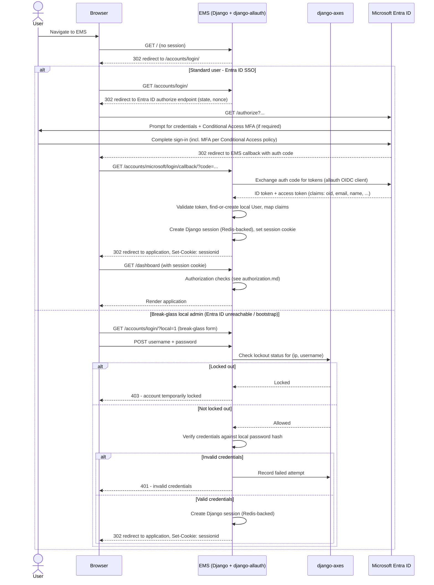

# Authentication

> Part of the security architecture package. See [security-architecture.md](../architecture/security-architecture.md) for the high-level narrative tying this document together with [authorization.md](./authorization.md) and [audit.md](./audit.md).

## 1. Decision Summary

| Concern | Decision |
|---|---|
| Primary identity provider | Microsoft Entra ID (corporate SSO) |
| Django integration | `django-allauth` (Microsoft/OIDC provider) |
| Fallback path | Local username/password, **break-glass only**, gated by `django-axes` |
| MFA | Delegated entirely to Entra ID Conditional Access — Django implements none |
| Session store | Redis-backed Django session engine |
| Session lifetime | 8-hour sliding timeout (configurable), aligned to a workday |
| Step-up re-authentication | Not implemented in Phase 00 — open question for future hardening |

## 2. Why Entra ID as the Primary IdP

**Assumption (pending confirmation from McDonald's Pakistan IT):** the corporate environment already standardizes on Microsoft 365 / Entra ID for staff identity. Given that assumption, EMS should not maintain its own username/password store for general users — doing so would mean a second identity to provision, rotate, and de-provision every time an employee joins, moves, or leaves, duplicating a lifecycle that Entra ID (and whatever HR/IT joiner-mover-leaver process feeds it) already owns. Federating to Entra ID also means:

- Password policy, breach detection, and MFA are inherited from whatever Conditional Access policy IT already enforces org-wide, instead of being re-implemented and re-audited inside EMS.
- Account disablement in Entra ID (e.g. on termination) immediately removes EMS access, without a separate "disable this HR system account" step that can be forgotten.
- Restaurant-level and corporate users authenticate the same way they already do for email/Teams/SharePoint — no new credential for staff to remember or phish.

## 3. Integration Approach: Alternatives Considered

Three integration paths were evaluated:

1. **Django's built-in auth alone (`django.contrib.auth`), no external IdP.**
   Rejected outright — it provides no SSO capability. Every user would need a locally-managed password, which is precisely what an Entra ID-standardized corporate environment should not require, and it would leave EMS solely responsible for password strength, rotation, breach response, and MFA — none of which is HR-system-specific work worth re-solving here.

2. **Raw MSAL (`msal` Python library) with a hand-rolled Django authentication backend.**
   Gives full control over the OIDC/OAuth2 token exchange, claims mapping, and session bootstrapping. Considered because it avoids taking a dependency on a third-party package's abstractions. Rejected as the *lead* choice because it means EMS owns the entire OIDC state machine by hand: authorization-code exchange, token validation and refresh, `nonce`/`state` CSRF protection, clock-skew handling, and key rollover (JWKS) — all security-sensitive code that a well-maintained library already gets right and keeps patched. This is more long-term maintenance burden than the project should take on for a capability that `django-allauth` already provides. **Retained as a documented fallback option** if `django-allauth`'s Microsoft provider proves insufficient for a requirement that emerges later (e.g. a non-standard claims mapping or a legacy ADFS coexistence scenario).

3. **`django-allauth` with its Microsoft / generic-OIDC provider — CHOSEN.**
   `django-allauth` is actively maintained, has a large plugin ecosystem, and already implements the OIDC authorization-code flow, state/nonce handling, token refresh, and social-account-to-Django-user linking that would otherwise need to be built and maintained in-house. It integrates cleanly with Django's standard `User` model and session framework, and its social-account adapter hooks give a clean extension point for mapping Entra ID claims (object ID, email, department, etc.) onto the local `User`/`UserScope` model at first login and on subsequent logins. This is the lead recommendation for Phase 00.

## 4. Break-Glass Local Authentication

A small number of designated superuser/admin accounts retain a local Django username/password credential, for the sole purpose of regaining administrative access if Entra ID is unreachable (tenant outage, misconfiguration, network partition to Microsoft) or if the OIDC integration itself is broken and needs to be fixed by someone logged into the app. This path is explicitly **not** available to general staff, managers, or any business role — employees, restaurant managers, area/regional managers, HR, Payroll, and Training all authenticate exclusively via Entra ID SSO.

Controls on the break-glass path:

- **`django-axes`** gates every local-auth attempt: lockout after N consecutive failures, tracked by IP address **and** username combination, with a configurable cooldown. This mitigates credential-stuffing/brute-force against the one authentication surface that isn't behind Entra ID's own protections.
- Break-glass accounts are provisioned and audited outside the normal user-lifecycle path (see [audit.md](./audit.md) — `permission.granted`/account-provisioning events are audit-logged like any other sensitive change).
- Break-glass credentials should follow standard secrets hygiene (strong, unique, stored in a password manager, rotated on personnel change) — this is an operational/runbook concern for Phase 01, not a code-level control.

## 5. Session Policy

- **Backend:** Redis-backed Django session engine (`django.contrib.sessions.backends.cache` pointed at Redis, or `django-redis`-backed cache-session). Redis is already a required piece of infrastructure for caching, so reusing it for sessions avoids introducing a second stateful store just for session data, while still keeping sessions server-side (never trusting a large signed cookie with sensitive session state).
- **Cookie:** `SESSION_COOKIE_SECURE=True`, `SESSION_COOKIE_HTTPONLY=True`, `SESSION_COOKIE_SAMESITE="Lax"` (or `"Strict"` if it doesn't break the Entra ID redirect round-trip in practice — verify during implementation).
- **Timeout (assumption, configurable):** an 8-hour sliding session timeout, matching a single workday shift — activity resets the countdown, inactivity for 8 hours ends the session and requires a fresh Entra ID sign-in (which, for an already-signed-in corporate device/browser, is typically silent/near-instant via Entra ID's own SSO session).
- **Step-up / forced re-authentication for highly sensitive actions** (e.g. re-prompting before viewing salary data or before a termination action) is **not implemented at this stage**. This is flagged as an **open question for future hardening**, not a Phase 00 blocking decision — it can be layered on later (e.g. via Conditional Access sign-in frequency policies scoped to the EMS application, or an in-app re-auth prompt) without changing the underlying session architecture.

## 6. MFA: Delegated to Entra ID

**EMS's Django application implements no MFA of its own.** This is a deliberate architectural boundary, not an omission:

- MFA enforcement (which factors, which Conditional Access policies apply to which users/locations/devices, step-up on risk signals) lives entirely in Entra ID.
- The Django application trusts the authentication assertion (ID token) it receives from Entra ID after the OIDC flow completes. If Entra ID's Conditional Access policy required MFA for that sign-in, the token EMS receives reflects a session that already satisfied it — EMS does not need to (and does not) independently verify which factors were used.
- This keeps MFA policy centrally managed by IT/Security for the whole Microsoft 365 estate (consistent policy across email, Teams, EMS, and any other Entra ID-federated app) rather than fragmented per application.
- **Boundary statement:** if Entra ID Conditional Access is ever misconfigured to not require MFA for the EMS application, EMS has no independent fallback enforcement. This is accepted as the correct trust boundary for a corporate-SSO-first design — closing it would mean EMS re-implementing IdP-level policy, which is out of scope for an HR line-of-business application.

## 7. Authentication Flow

The diagram below shows the OIDC redirect round-trip for the normal (Entra ID) path, and the break-glass local-auth branch for designated admin accounts.

## 8. What This Document Does Not Cover

- Fine-grained access control after authentication succeeds: see [authorization.md](./authorization.md).
- What gets logged about authentication events (sign-in, sign-out, lockout) at the audit layer: see [audit.md](./audit.md).
- Secrets management for OIDC client ID/secret and Redis connection strings: see [security-architecture.md](../architecture/security-architecture.md#5-secrets-management).
